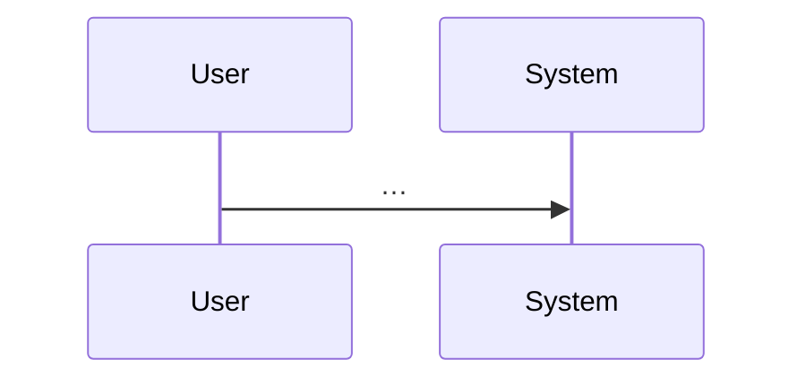

# Feature request — reference templates

Used by **`.cursor/skills/feature-request/SKILL.md`**. Keep templates in **markdown**; issue trackers (Jira, Asana, Linear) can import the tables as-is or copy-paste.

---

## User-facing session close (chat reply or handoff stub)

Use at the **end** of every reply that stops **`FR-NNNN`** work for the user. Copy the structure into **`handoffs/*.md`** when you also persist a handoff.

```markdown
### Executive summary
- … (outcomes, artifacts, decisions; lead with ticket **titles** + links to `tickets.md`)

### Suggested next step
… (one primary action)

### Options *(omit if only one reasonable path)*
- **A.** …
- **B.** …
```

For **closeout**, fold the same content into **`90-closeout.md`** as sections or lead paragraphs (see **Closeout (`90-closeout.md`)** below).

---

## Closeout (`90-closeout.md`)

Narrative sections for **`90-closeout.md`** should cover the same three ideas in order — **executive summary**, **primary next step for the team**, **optional multiple follow-up paths** — plus links to every artifact in the feature folder.

```markdown
# FR-NNNN — Closeout

## Executive summary
…

## What shipped vs deferred
…

## Artifact index
- … (link every file under `tasks/feature-history/FR-NNNN-<slug>/`)

## Tickets
- … (title + link to each `###` in `tickets.md`)

## Suggested next step
…

## Options / follow-ups *(if applicable)*
- …
```

---

## Intake (append to `00-intake.md`)

```markdown
# FR-NNNN — Intake

| Field | Value |
|------|--------|
| **Title** | |
| **Requester** (optional) | |
| **Target timeline** (optional) | e.g. Q3, 6 weeks, before release X |
| **Constraints** | e.g. offline, no new deps, must reuse module X |
| **Success definition** (1–3 bullets) | |
| **Out of scope** | |
| **Links** | design docs, tickets, mocks |

**Raw details** (prose the user or PM provided):
…
```

---

## Design — skeleton (interfaces only)

```markdown
# FR-NNNN — Design (level 0, skeleton)

## Purpose
One paragraph.

## Actors
- …

## Public surfaces (skeleton)
Only contracts: module boundaries, public types, API routes, event names. No implementation.

| Surface | Kind | Contract (signature / schema sketch) | Owner (logical) |
|---------|------|----------------------------------------|-----------------|
| | | | |

## Data in / out
| Input | Output | Storage |
|-------|--------|---------|
| | | |

## Open questions
- …
```

---

## Design — depth ladder

Add sections **L1, L2, …** only as complexity requires:

- **L1:** sequence diagram (mermaid) for main flow; error paths named.
- **L2:** state for each persistent entity; idempotency and concurrency notes.
- **L3:** performance budget (latency, throughput) if user cited scale or SLOs.
- **L4+:** security, migration, roll-back — if applicable.



---

## Tickets + dependency DAG (Jira/Asana-ready)

**Human-facing rule:** The **Title** column is the primary name in prompts, diaries, and handoffs. Use **ID** for deps, branches, and `ticket-progress.md`. When talking to the user, pair **title + linked id** to `tickets.md` (see **`.cursor/skills/feature-request/SKILL.md` → Human-readable names vs ticket ids**).

```markdown
# FR-NNNN — Work breakdown and DAG

## Ticket table

| ID | Title (required — human-facing name) | Type | Deps (ticket IDs) | Summary of change (1–2 lines) | Suggested order group | Link (optional) |
|----|----------------------------------------|------|---------------------|------------------------------|------------------------|-----------------|
| T-FR-0007-01 | Contract: public API surface | Story/Task | none | … | P0 foundation | [details](tickets.md#anchor-after-promote) |
| T-FR-0007-02 | Implement batch ingest path | Story/Task | T-FR-0007-01 | … | P1 | [details](tickets.md#…) |

**Parallelization rule:** Any two tickets with **disjoint** transitive file/code ownership and **all deps in earlier VAL-done** can run in parallel (same rule as `identify-frontier`).

## DAG (Mermaid)

Use a **second** code fence in the real doc (nesting is invalid inside one template block). **Label nodes with title, then id in parentheses** (ids stay unique as Mermaid node ids):

    flowchart TB
      T01["Contract: public API surface (T-FR-0007-01)"]
      T02["Implement batch ingest path (T-FR-0007-02)"]
      T01 --> T02

## Map to feature **`tickets.md`** + global index

- For each **`T-FR-NNNN-xx`**: add **`###`** sections to **`tasks/feature-history/FR-NNNN-<slug>/tickets.md`** with **Deps:** matching the DAG and **Phases** tables.
- Register the feature path in **`tasks/feature-history/TICKET-SOURCES.md`**.
- Extend **`docs/design/tickets-initial.md`**: feature table row + **global mermaid** edges / **`triadDone`** as needed.
- Add rows to **`tasks/ticket-progress.md`**.

## Suggested `identify-frontier` check

After tickets land, run **`/identify-frontier`** and confirm the **parallel-capable** set matches the DAG (eligible ∩ incomplete).
```

---

## User prompts (copy-paste)

**After design + tickets are written:** name work by **title**, with ticket id linked to **`tickets.md`** for detail (example pattern):

1. "Ready to start implementation: run **`/develop-frontier`** for the current parallel-capable set — e.g. **Contract: public API surface** ([`T-FR-0007-01`](tasks/feature-history/FR-NNNN-<slug>/tickets.md)), **Implement batch ingest path** ([`T-FR-0007-02`](tasks/feature-history/FR-NNNN-<slug>/tickets.md)) — or implement one stream serially if you prefer."
2. "Continue: proceed to the next items by **title** in dependency order (links in **`tickets.md`**), or re-run **`/identify-frontier`** if the queue changed."
3. "Close this feature’s implementation: run **`/finish-feature`** (merge ticket/stage branches into **`feat/FR-NNNN-<slug>`**, validate, **PR → `main`**) per **`docs/ai-context.md` §2d** — or **`/finish-frontier`** if integrating ticket/stage branches straight into **`main`**."

---

## Serial diary (append one block per session)

```markdown
## YYYY-MM-DD (session) — <agent or human>

**Stage:** e.g. design L1 / tickets / post-merge

**Recap (plain English):** What we did, what is blocked, what is next. When referencing tickets, use **title + [id](tickets.md#…)** not bare ids.
```

## Parallel agent diary (one file per stream)

`parallel/<T-FR-NNNN-xx>-<short-title-slug>.md` — same format as serial; include the ticket id for uniqueness and a **title slug** so filenames stay human-readable; do not clobber other agents’ files.

---

## Feature handoff (`handoffs/YYYY-MM-DD-continue.md`)

```markdown
# FR-NNNN — Continue handoff (YYYY-MM-DD)

**Git:** branch(es) `feat/…`, last known SHAs: …

**Done since last handoff:** …

**Next agent should:** …

**Risks / blockers:** …

**Links:** `serial-diary.md`, `parallel/…`, PRs, `tasks/handoffs/…` (if any)
```

---

## Merged diary stack (`DIARY.md`)

Newest block at **top**. Each block keeps the **raw** sources (**`serial-diary.md`**, **`parallel/foo.md`**) — do **not** delete those files when adding **`DIARY.md`**.

```markdown
# FR-NNNN — Merged diary (stack: newest first)

## YYYY-MM-DD — from `parallel/T-FR-0007-02-batch-ingest.md` @ `abc1234`

**Recap:** … (cite tickets as **title** + link to `tickets.md` in the body)

---

## YYYY-MM-DD — from `serial-diary.md` @ `def5678`

**Recap:** …
```

---

## Branch state (repo-root `CURRENT.md`)

Use on **`feat/FR-NNNN-<slug>`** and **`feat/FR-NNNN-<slug>/T-…`** branches only; see **`.cursor/skills/feature-request/SKILL.md` → Branch state (`CURRENT.md`)** for **`main`** policy. Replace placeholders; keep under ~40 lines.

```markdown
# Current branch state

| Field | Value |
|------|--------|
| **FR** | FR-NNNN |
| **Feature folder** | `tasks/feature-history/FR-NNNN-<slug>/` |
| **This branch** | `…` (feature integration or ticket) |
| **Parent branch** | `feat/FR-NNNN-<slug>` (if this is a ticket branch) |
| **Last meaningful update** | YYYY-MM-DD |

## What is on this branch

- …

## In flight / blockers

- …

## Next

1. … (e.g. run VAL, merge to feature branch, open PR — link `tasks/ticket-progress.md` and `handoffs/` as needed)
```

---

## Dev environment (MkDocs / Docker)

Repositories that ship **`./develop`**, **`compose.yaml`**, and **`scripts/serve-docs.sh`**: run development-specific commands in Docker / Docker Compose / Dev Container where possible. During design or before doc **VAL**, run **`./develop up`**; for a static build in Docker, **`./develop build`**. Use **`./develop local`** only as a documented host fallback. See **`.cursor/skills/feature-request/SKILL.md`** (local dev section) and root **`README.md`**.
