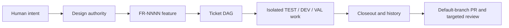
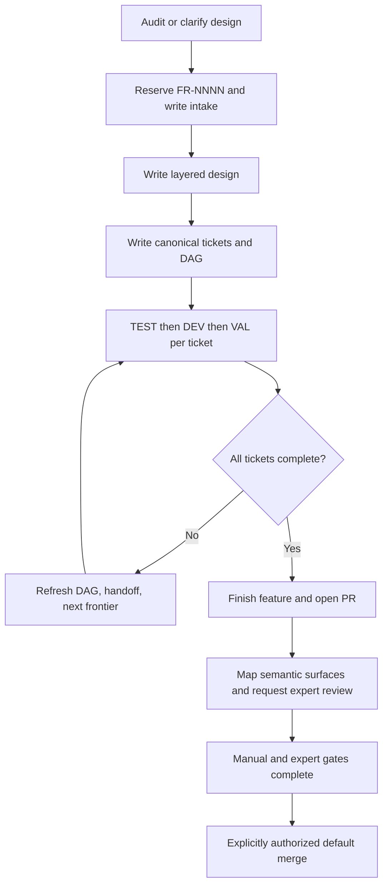
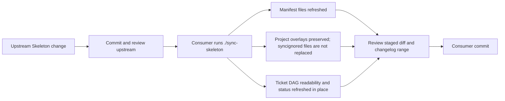

# Harness Guide

> **Read this before taking action in a Skeleton-based repository.**
>
> This file is a map, not a source of truth. It tells a human or a newly arrived
> agent which live rule, design document, skill, tracker, or script owns the next
> decision. When this guide and a linked source disagree, the linked source wins.

## The short version

Skeleton is the repository's delivery harness. It does not choose the product or
technology stack. It supplies a shared way to turn human intent into authoritative
design, numbered features and tickets, isolated implementation work, validation,
review, and an auditable closeout.



The harness has two layers:

- **The project root** contains the live, project-owned design, code, trackers,
  overlays, and Git history.
- **`.skeleton/`** contains the upstream process template. `./sync-skeleton`
  updates the submodule and refreshes manifest-listed root files. Project-owned
  overlays and syncignored files survive that refresh. Ticket DAGs receive only
  the narrow, idempotent in-place readability/status migration documented in
  **`INIT.MD`**; their stable ids and dependency edges are preserved.

Read [the consumer layout](docs/skeleton-consumer-root-layout.md),
[the initialization manual](INIT.MD), and
[the overlay contract](docs/skeleton-project-overlays.md) before changing how
those layers interact.

## Before any action

1. Read the agent entry point for the current host: [AGENTS.md](AGENTS.md),
   [CLAUDE.md](CLAUDE.md), or the [Cursor rules](.cursor/rules/).
2. Follow the load order in [docs/ai-context.md](docs/ai-context.md). Project
   overlays load after template-wide rules.
3. Read `git status`, the current branch, and any active `CURRENT.md` before
   writing. Do not treat a dirty tree as cleanup work.
4. Read the authoritative design under [docs/design/](docs/design/) for the
   area being changed. If it is missing or ambiguous, stop with `DESIGN-GAP`.
5. Preserve affected `EXPERT-REVIEW` annotations and likely review areas. They
   do not gate ticket work; the default-branch PR later resolves them through
   the base [expert roster](docs/design/EXPERTS.md) and project-owned
   `docs/design/EXPERTS.project.md`.
6. If ticket work is involved, read [ticket progress](tasks/ticket-progress.md),
   the [feature registry](tasks/feature-history/REGISTRY.md), and the owning
   feature's `tickets.md` and `20-tickets-dag.md`.
7. Open the exact [skill](.cursor/skills/) or [command](.claude/commands/) for
   the requested workflow. This guide is not permission to skip its gates.

A request to inspect, explain, or diagnose is read-only unless the human also
asks for edits or delivery. A request to implement does not silently authorize
force pushes, remote-branch deletion, or final default-branch merging. Expert
approval is review evidence, not merge authorization.

## Where truth lives

| Question | Owning source |
|---|---|
| How should an agent start and work? | [docs/ai-context.md](docs/ai-context.md), then the active host's mirrored rules |
| What behavior should the system have? | The applicable document under [docs/design/](docs/design/) |
| Who must review a sensitive design area? | [docs/design/EXPERTS.md](docs/design/EXPERTS.md), `docs/design/EXPERTS.project.md` when present, and nearby `EXPERT-REVIEW` annotations; protocol in [expert-review.md](docs/design/expert-review.md) |
| Which feature and tickets own the work? | [feature registry](tasks/feature-history/REGISTRY.md), the feature folder, and [ticket progress](tasks/ticket-progress.md) |
| Which numbered identifiers are available? | [tasks/TAG-REGISTRY.md](tasks/TAG-REGISTRY.md) and the feature registry |
| How should a named workflow run? | The matching [Cursor skill](.cursor/skills/), [Claude command](.claude/commands/), or [Codex wrapper](.agents/skills/) |
| What does synchronization copy? | [skeleton.manifest](skeleton.manifest), [.syncignore](.syncignore), and [sync implementation](scripts/sync-skeleton.sh) |
| What changed in the template? | [CHANGELOG.md](CHANGELOG.md), especially the exact version/SHA range crossed by a sync |
| What is true right now? | Current files, Git state, validation output, and remote PR/review state |

Generated summaries, dashboards, explanations, and this guide are views of the
system. They do not override the sources above.

## Main human workflows

The command name describes intent. A raw agent without slash-command support
should read the linked definition and follow the same procedure.

| Intent | Entry point | Main input | Reviewable output |
|---|---|---|---|
| Check whether design is ready | [`/audit-design`](.cursor/skills/audit-design/SKILL.md) | One top-level design path | Read-only Ready/Caution/Blocked report, including expert gates |
| Check a security surface | [`/audit-security`](.cursor/skills/audit-security/SKILL.md) | Design, code, service, dependency, protocol, or release scope | Evidence-linked security findings; no implementation |
| Create a feature | [`/feature-request`](.cursor/skills/feature-request/SKILL.md) | Human request or audited design | Reserved `FR-NNNN`, design layers, canonical tickets, DAG, and implementation choice |
| Expand an existing feature | [`/expand-feature`](.cursor/skills/expand-feature/SKILL.md) | Existing `FR-NNNN` plus added behavior | Same-feature design/ticket expansion scaled to the change |
| Route an operator bug | [`/feature-bug`](.cursor/skills/feature-bug/SKILL.md) | One observed issue | One report, one solving ticket, one TEST→DEV→VAL lane |
| Find parallel-ready tickets | [`/identify-frontier`](.cursor/skills/identify-frontier/SKILL.md) | Canonical tickets, dependencies, and progress | Dependency-safe frontier handoff |
| Implement a frontier | [`/develop-frontier`](.cursor/skills/develop-frontier/SKILL.md) | Eligible tickets and clean feature worktrees | Isolated ticket branches, validation evidence, refreshed DAG/progress |
| Finish one feature | [`/finish-feature`](.cursor/skills/finish-feature/SKILL.md) | Feature-complete branch and green validation | PR, requested expert reviewers, closeout, explanation, and manual refresh |
| Integrate a direct frontier | [`/finish-frontier`](.cursor/skills/finish-frontier/SKILL.md) | Validated ticket branches and integration policy | Dependency-safe integration with shared-file reconciliation |
| Explain completed work | [`/explain-feature`](.cursor/skills/explain-feature/SKILL.md) | Completed `FR-NNNN` evidence | Before/after HTML explanation and review checklist |
| Explain code | [`/code-tour`](.cursor/skills/code-tour/SKILL.md) | A scoped code area | Interactive, evidence-linked HTML walkthrough |
| Maintain the manual | [`/update-manual`](.cursor/skills/update-manual/SKILL.md) | Code diff since last reviewed hash | Updated static manual, search/index, and review hash |
| Sync template changes | [`/sync-skeleton`](.cursor/skills/sync-skeleton/SKILL.md) | Clean root/DAGs, remote access, pinned `.skeleton` | Updated submodule, staged manifest copies, and reviewed idempotent DAG migration |

Other specialized workflows live in [`.cursor/skills/`](.cursor/skills/) with
mirrors under [`.claude/commands/`](.claude/commands/) and
Codex entry points under [`.agents/skills/`](.agents/skills/). The
[agent-doc sync rule](.codex/rules/agent-doc-sync.md) requires equivalent intent
and safety across hosts.

## The feature path



Features and tickets are different identities. `FR-NNNN` owns intent, design,
history, and closeout. `T-FR-NNNN-xx` owns an implementable unit with explicit
dependencies and TEST/DEV/VAL phases. The feature-local `20-tickets-dag.md`
must show current state; [docs/design/tickets-initial.md](docs/design/tickets-initial.md)
is the global index and DAG.

## Expert review is a final default-merge gate

An authoritative design section can declare:

```markdown
> **EXPERT-REVIEW:** `EXPERT:security`
```

The identifier resolves through [docs/design/EXPERTS.md](docs/design/EXPERTS.md)
plus `docs/design/EXPERTS.project.md` when present to a human name or role,
contact route, GitHub reviewer, and scope. Default-branch PR preparation maps
both changed paths and semantic effects on protected interfaces, invariants,
algorithms, data flows, risks, and acceptance behavior to the relevant experts.
That meaning-aware routing can be more precise than path-only CODEOWNERS.

The tag does not block design, ticketing, TEST -> DEV -> VAL, `triadDone`,
frontier dispatch, feature closeout, or non-default-branch merges and pushes.
While the default-branch PR is open, the agent must:

- identify every required expert and the semantic surface that triggered them;
- request the mapped PR reviewer;
- record the approval or pending state in the PR/feature evidence; and
- keep unresolved mappings or reviews visible without reopening ticket triads.

Immediately before final merge to `main`, `master`, or the repository's other
default branch, recheck the current PR head and require scoped approvals with no
applicable changes-requested review. Expert approval and user manual validation
are separate gates; neither substitutes for the other. Neither authorizes an
agent to merge, so explicit workflow authority is still required.

CODEOWNERS and branch protection may add platform enforcement, but never replace
the semantic map. Say which enforcement is actually verified.

The complete rules, annotation format, scope matching, evidence format, and
failure behavior are in [docs/design/expert-review.md](docs/design/expert-review.md)
and the mirrored [expert-review rule](.cursor/rules/expert-review.mdc).

## Synchronization model



Do not edit `.skeleton/` casually from a consumer. Generic process improvements
move upstream through the documented harness-update/flush path. Product-specific
rules belong in project overlays. Read [the maintainer guide](docs/skeleton-MAINTAINERS.md)
before changing the template itself.

## A complete handoff

Tell the next human or agent:

- which branch, worktree, feature, and tickets were involved;
- which design files governed the change;
- which `EXPERT:<slug>` gates applied, which semantic surfaces triggered them,
  whom they resolved to, and the approval evidence or pending reviewer;
- what changed and what validation ran;
- what was committed, pushed, staged, opened as a PR, or left local;
- what was skipped or blocked and why; and
- the next concrete decision or command.

If you cannot find the owner of a rule, design statement, or identifier, stop
at read-only inspection and return to [Where truth lives](#where-truth-lives).
An unresolved expert mapping is instead recorded on the default-branch PR and
blocks only its final merge.
