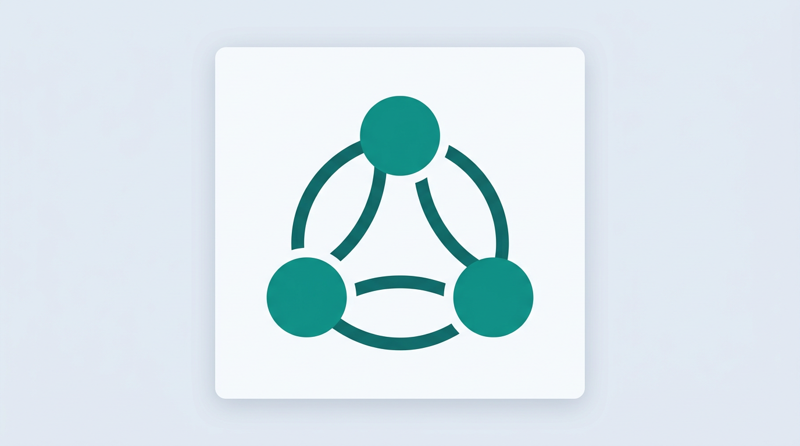

<p align="center">
  
</p>

# Finance Hub

**Self-hosted personal finance:** ingest statements and receipts, normalize everything into one datastore, explore spending and income, and (as the roadmap matures) tie it to goals, budgets, and projections—without handing your ledger to a third-party SaaS.

Finance Hub is aimed at people who want **ownership of their data**, a **clear audit trail** from raw files to categorized transactions, and a path from today’s balances to **future scenarios**. The stack pairs a Python/FastAPI backend with a React dashboard, SQLite (upgradeable to PostgreSQL), and documentation-first design so the system can evolve deliberately.

## Why this project exists

- **Privacy and control** — Your statements stay on infrastructure you run.
- **Unified model** — Multiple banks and formats normalize into one transaction schema.
- **CLI and API first** — Automate ingests and queries; the UI builds on the same contracts.
- **Documented architecture** — Behavior and boundaries are spelled out in `docs/design/` so contributors can align with intent.

## What’s here today

Roadmap phases are tracked in the [documentation home](docs/index.md). In short: **ingestion, storage, and analysis** are the near-term focus; goals, unified dashboards, projections, and optional crypto portfolio tooling are phased after that.

## Quick start

The fastest path for local development is Docker:

```bash
./scripts/dev.sh
```

This brings up the API and web UI (see [docs/PORTS.md](docs/PORTS.md) for defaults). For a full native setup, database initialization, and first ingest, follow **[Getting Started](docs/GETTING_STARTED.md)**.

## Repository layout

- `src/` — Python package (`finance`, API, ingestion, queries)
- `frontend/` — Vite + React dashboard
- `docs/` — MkDocs site (design, guides, port registry)
- `scripts/` — Development and automation helpers

## Documentation

- **User and operator guides:** `docs/` (build locally with `mkdocs serve` from the project root if you have dev dependencies installed)
- **Architecture and services:** `docs/design/`

## Contributing

Issues and pull requests are welcome. Please read the design notes for the area you’re changing so behavior stays consistent with the documented model. Tests and type checks are part of the usual workflow (`pytest`, `mypy`—see `pyproject.toml` and CI if present).

## Acknowledgments

Built as an open, extensible finance hub—not a replacement for professional tax or investment advice.
