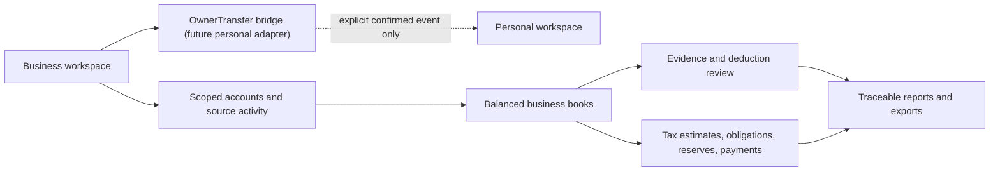

# Business finance workspace

FR-0007 adds a distinct Business workspace to Finance Hub for contract-work bookkeeping and tax readiness. It is designed as part of the same local-first application while enforcing a hard data boundary between Personal and each Business workspace.

## Product promise

The first delivery supports:

- business checking, reserve, and credit-card accounts;
- imported/manual income and expense activity;
- balanced classification of transfers, card payments, refunds, owner activity, and tax payments;
- deduction candidates, mixed-use allocation, business purpose, and supporting evidence;
- statement reconciliation, cash-basis reports, and traceable exports;
- versioned tax projections or confirmed obligations;
- reserve targets, actually reserved cash, payments, and visible gaps;
- a stable future owner-transfer seam into Personal income and budgeting.

The workspace is not tax-return software and does not decide deduction eligibility, submit payments, or guarantee a tax calculation. Payroll, sales tax, invoicing/receivables, advanced tax engines, inventory/assets, accrual close, and automatic Personal posting are later modules.

## Boundary model

Every persistent and public business record is workspace-scoped. Existing Personal data is backfilled into a seeded Personal workspace. A legacy `is_flagged_business` value can seed a review queue but cannot authorize, isolate, or automatically migrate records.

## Accounting model

Imported/manual source rows are preserved as immutable facts. A guided review creates balanced debit/credit postings so economic events retain the right meaning:

- a client receipt creates income once;
- a card purchase creates an expense and card liability;
- paying the card moves cash against the liability without creating another expense;
- moving money to a reserve account changes cash location without paying tax;
- owner contributions/draws change cash/equity without changing business profit;
- corrections reverse or supersede posted history instead of deleting it.

## Tax-state model

The interface and API keep five concepts distinct:

1. **Projection** — a versioned planning calculation with assumptions, missing inputs, source/ruleset, and confidence.
2. **Obligation** — a projected or user/adviser/authority-confirmed amount and due date.
3. **Reserve target** — a policy amount the owner intends to protect.
4. **Reserved cash** — reconciled cash actually set aside in a designated account or bounded bucket.
5. **Payment** — a settled cash event linked to one or more obligations and evidence.

A flat reserve percentage is planning, not “tax due.” Rules, calendars, forms, entity treatment, and jurisdictions are effective-dated and re-reviewed for the active tax year.

## User experience

Business uses an explicit workspace switcher and its own addressable routes, side navigation, and visible Business/entity cues. The primary areas are Overview, Accounts & cards, Transactions, Income, Expenses, Deductions & receipts, Tax Center, Reports, and Business settings.

Visual designs:

- [Business shell and overview](mockups/fr-0007-business-shell-overview.html)
- [Accounts and activity review](mockups/fr-0007-business-activity-review.html)
- [Deductions and receipts](mockups/fr-0007-deductions-receipts.html)
- [Tax Center](mockups/fr-0007-tax-center.html)

## Current reference sources

Checked 2026-08-14; implementation must re-check current tax-year material.

- [IRS recordkeeping guidance](https://www.irs.gov/businesses/small-businesses-self-employed/what-kind-of-records-should-i-keep)
- [IRS estimated-tax guidance](https://www.irs.gov/businesses/small-businesses-self-employed/estimated-taxes)
- [IRS self-employment tax](https://www.irs.gov/businesses/small-businesses-self-employed/self-employment-tax-social-security-and-medicare-taxes)
- [IRS Schedule C overview](https://www.irs.gov/forms-pubs/about-schedule-c-form-1040)
