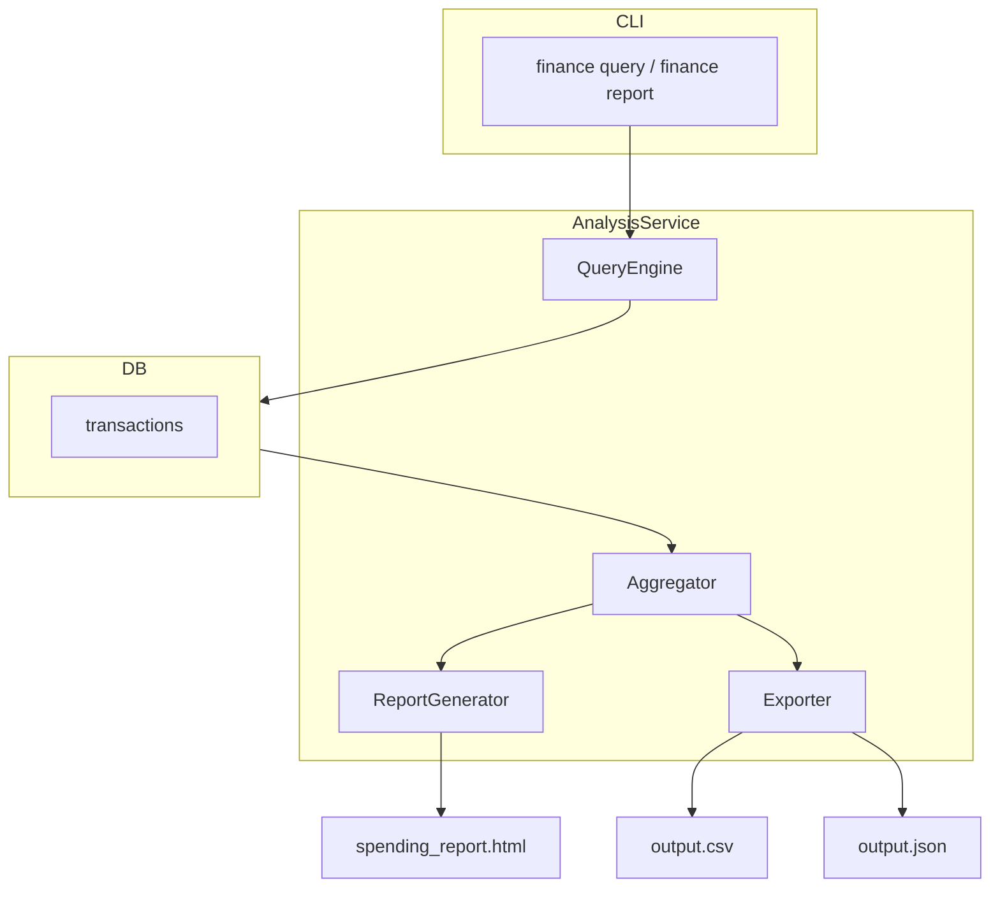

# Analysis Service — Overview

**Phase**: 1 (MVP)

**Location**: `src/finance/analysis/`

## Purpose

The Analysis Service answers questions about your financial data. It provides the query engine, aggregation functions, and report generation that turn normalized transaction records into understandable spending insights.

## Responsibilities

- Query transactions with flexible filters (date, category, merchant, amount, account)
- Aggregate transactions into summaries (by category, merchant, time period)
- Generate interactive HTML spending reports
- Export query results to CSV and JSON
- Compute key metrics (total spent, average per transaction, top merchants)

## Out of Scope (Phase 1)

- Goal/budget tracking (Phase 2)
- Trend analysis and projections (Phase 3)
- Web API endpoints (Phase 2)

## Architecture



## Module Structure

```
src/finance/analysis/
├── __init__.py
├── service.py          # AnalysisService — orchestrates queries and reports
├── query.py            # QueryEngine — builds and executes SQL queries
├── aggregator.py       # Aggregator — computes metrics from query results
├── report.py           # ReportGenerator — renders HTML report
├── exporter.py         # Exporter — CSV and JSON output
└── models.py           # QueryFilter, AggregationResult, SpendMetrics (Pydantic)
```

## Query Filter Model

```python
@dataclass
class QueryFilter:
    date_from: date | None = None
    date_to: date | None = None
    categories: list[str] | None = None
    merchant_contains: str | None = None
    amount_min: Decimal | None = None
    amount_max: Decimal | None = None
    account_names: list[str] | None = None
    include_credits: bool = False
    limit: int | None = None
```

## Aggregation Modes

| Mode | Description | Output |
|------|-------------|--------|
| `by_category` | Total spent per category | Category → amount, count, percentage |
| `by_merchant` | Top N merchants by spend | Merchant → amount, count |
| `by_month` | Monthly spend totals | Month → amount, count |
| `by_week` | Weekly spend totals | Week → amount, count |
| `by_day` | Daily spend totals | Date → amount |
| `summary` | Overall metrics | Total, credits, net, avg/transaction |

## Report Generation

The HTML report is a self-contained file with:

- Summary cards (total spent, credits, net, transaction count, avg)
- Category breakdown (doughnut chart + bar chart, click-to-filter)
- Daily spend trend (line chart)
- Top merchants (horizontal bar chart)
- Category summary accordion (expandable per-category transaction list)
- Full transaction table (searchable, filterable)

The report logic is adapted and extended from `misc/spending_analysis.py`, generalized to support multi-account data and configurable date ranges.

## Phase 2 Extensions

- Web API endpoints (FastAPI) for dashboard data
- Goal vs. actual comparison overlays in reports
- Multi-account consolidated views
- Month-over-month comparison reports
