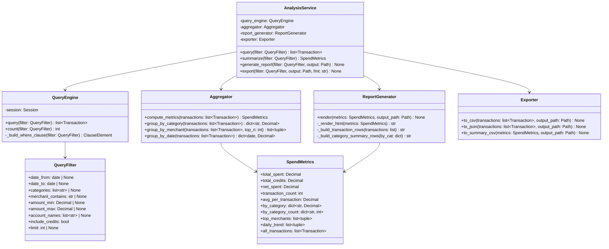
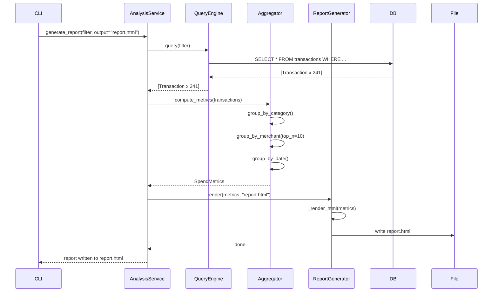

# Analysis Service — Data Model & UML

## Class Diagram

```mermaid
classDiagram
    class QueryFilter {
        +date_from: date | None
        +date_to: date | None
        +categories: list~str~ | None
        +merchant_contains: str | None
        +amount_min: Decimal | None
        +amount_max: Decimal | None
        +account_names: list~str~ | None
        +include_credits: bool
        +limit: int | None
    }

    class SpendMetrics {
        +total_spent: Decimal
        +total_credits: Decimal
        +net_spent: Decimal
        +transaction_count: int
        +avg_per_transaction: Decimal
        +by_category: dict~str, Decimal~
        +by_category_count: dict~str, int~
        +top_merchants: list~tuple~
        +daily_trend: list~tuple~
        +all_transactions: list~Transaction~
    }

    class QueryEngine {
        -session: Session
        +query(filter: QueryFilter) list~Transaction~
        +count(filter: QueryFilter) int
        -_build_where_clause(filter: QueryFilter) ClauseElement
    }

    class Aggregator {
        +compute_metrics(transactions: list~Transaction~) SpendMetrics
        +group_by_category(transactions: list~Transaction~) dict~str, Decimal~
        +group_by_merchant(transactions: list~Transaction~, top_n: int) list~tuple~
        +group_by_date(transactions: list~Transaction~) dict~date, Decimal~
    }

    class ReportGenerator {
        +render(metrics: SpendMetrics, output_path: Path) None
        -_render_html(metrics: SpendMetrics) str
        -_build_transaction_rows(transactions: list) str
        -_build_category_summary_rows(by_cat: dict) str
    }

    class Exporter {
        +to_csv(transactions: list~Transaction~, output_path: Path) None
        +to_json(transactions: list~Transaction~, output_path: Path) None
        +to_summary_csv(metrics: SpendMetrics, output_path: Path) None
    }

    class AnalysisService {
        -query_engine: QueryEngine
        -aggregator: Aggregator
        -report_generator: ReportGenerator
        -exporter: Exporter
        +query(filter: QueryFilter) list~Transaction~
        +summarize(filter: QueryFilter) SpendMetrics
        +generate_report(filter: QueryFilter, output: Path) None
        +export(filter: QueryFilter, output: Path, fmt: str) None
    }

    AnalysisService --> QueryEngine
    AnalysisService --> Aggregator
    AnalysisService --> ReportGenerator
    AnalysisService --> Exporter
    QueryEngine --> QueryFilter
    Aggregator --> SpendMetrics
    ReportGenerator --> SpendMetrics
```

## Sequence Diagram — Report Generation

```mermaid
sequenceDiagram
    participant CLI
    participant AnalysisService
    participant QueryEngine
    participant Aggregator
    participant ReportGenerator

    CLI->>AnalysisService: generate_report(filter, output="report.html")
    AnalysisService->>QueryEngine: query(filter)
    QueryEngine->>DB: SELECT * FROM transactions WHERE ...
    DB-->>QueryEngine: [Transaction x 241]
    QueryEngine-->>AnalysisService: [Transaction x 241]

    AnalysisService->>Aggregator: compute_metrics(transactions)
    Aggregator->>Aggregator: group_by_category()
    Aggregator->>Aggregator: group_by_merchant(top_n=10)
    Aggregator->>Aggregator: group_by_date()
    Aggregator-->>AnalysisService: SpendMetrics

    AnalysisService->>ReportGenerator: render(metrics, "report.html")
    ReportGenerator->>ReportGenerator: _render_html(metrics)
    ReportGenerator->>File: write report.html
    ReportGenerator-->>AnalysisService: done

    AnalysisService-->>CLI: report written to report.html
```
