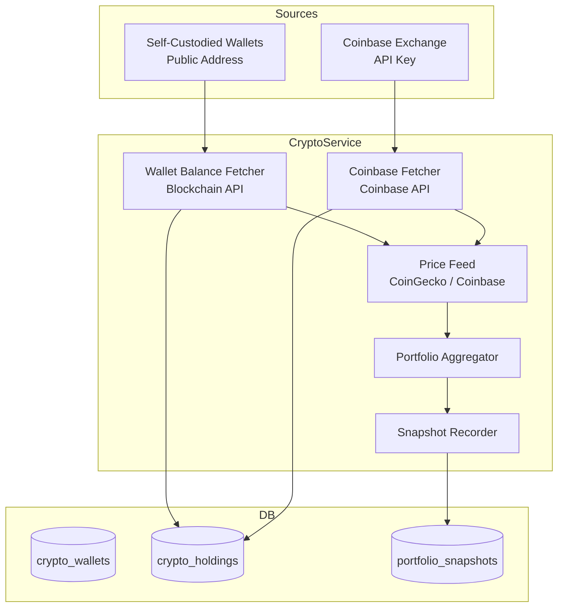

# Crypto Portfolio Service — Overview

**Phase**: 4 (Planned)

**Location**: `src/finance/crypto/` *(not yet implemented)*

## Purpose

The Crypto Portfolio Service tracks your cryptocurrency holdings and their current USD value, integrating them into the unified financial picture alongside traditional spending, income, and liabilities.

It supports two complementary data sources:

1. **Self-custodied wallets** — wallets you own where you hold the private keys. You provide the public address and the service looks up the on-chain balance.
2. **Coinbase** — balances held on the Coinbase exchange, fetched via the Coinbase Advanced Trade API using a read-only API key.

## Planned Capabilities

- Add a wallet by address and coin type (BTC, ETH, SOL, etc.) — balance fetched from a public blockchain API
- Add a Coinbase account connection — all Coinbase balances fetched via API
- Display current USD value of each holding using live price feeds (CoinGecko or Coinbase Price API)
- Show total crypto portfolio value aggregated across all sources
- Include crypto holdings in the net worth view alongside cash, real estate, and liabilities (Phase 2+)
- Historical snapshots: record portfolio value over time to show growth/decline trend
- Unrealized gain/loss: compare current value against cost basis (if cost basis is provided)

## Architecture



## Data Model

### `crypto_wallets` table

| Column | Type | Description |
|--------|------|-------------|
| `id` | int PK | |
| `label` | string | User-defined label (e.g., "Cold Storage BTC") |
| `coin` | string | Ticker symbol: BTC, ETH, SOL, etc. |
| `address` | string | Public wallet address |
| `source` | string | `"wallet"` or `"coinbase"` |
| `coinbase_account_id` | string | Coinbase account UUID (if source = coinbase) |
| `created_at` | datetime | |

### `crypto_holdings` snapshot

| Column | Type | Description |
|--------|------|-------------|
| `id` | int PK | |
| `wallet_id` | int FK | References `crypto_wallets` |
| `balance` | decimal | Coin quantity held |
| `price_usd` | decimal | Spot price at snapshot time |
| `value_usd` | decimal | `balance × price_usd` |
| `snapshotted_at` | datetime | When this balance was recorded |

## External API Integrations

### Self-Custodied Wallets — Blockchain APIs

Balance is fetched from public APIs that don't require authentication:

| Coin | API | Endpoint pattern |
|------|-----|-----------------|
| BTC | Blockstream Esplora | `https://blockstream.info/api/address/{address}` |
| ETH + ERC-20 | Etherscan | `https://api.etherscan.io/api?module=account&action=balance&address={address}` |
| SOL | Solana RPC | `https://api.mainnet-beta.solana.com` (JSON-RPC `getBalance`) |
| Other | CoinGecko | API varies by chain |

> **Privacy note**: Querying your public address against a third-party API reveals your holdings to that API provider. For maximum privacy, run a local node. This service defaults to public APIs for simplicity in Phase 4.

### Coinbase — Advanced Trade API

Uses the Coinbase Advanced Trade API with a read-only API key (never write permissions).

**Setup**:

1. Create a Coinbase API key at `coinbase.com/settings/api`
2. Grant **read-only** permissions only: `wallet:accounts:read`, `wallet:transactions:read`
3. Store credentials in `~/.finance/config.toml` under `[coinbase]` — never committed to source control

**Key endpoints used**:

- `GET /api/v3/brokerage/accounts` — list all Coinbase accounts and balances
- `GET /api/v3/brokerage/products/{product_id}/ticker` — current price for a trading pair

### Price Feed — CoinGecko

Spot prices for all coins fetched from CoinGecko's free public API:

- `GET https://api.coingecko.com/api/v3/simple/price?ids={coin_ids}&vs_currencies=usd`

CoinGecko is used as the canonical price source to ensure consistent USD valuation across wallet and Coinbase holdings.

## Configuration

In `~/.finance/config.toml`:

```toml
[coinbase]
api_key = "your-api-key"       # read-only key from Coinbase
api_secret = "your-api-secret"  # keep secret — never commit

[crypto]
refresh_interval_minutes = 60   # how often to auto-refresh balances
price_source = "coingecko"      # coingecko | coinbase
```

## CLI (Planned)

```bash
# Add a self-custodied wallet
finance crypto add-wallet --label "Cold Storage" --coin BTC --address bc1q...

# Add a Coinbase connection (reads API key from config)
finance crypto add-coinbase

# Show current portfolio value
finance crypto portfolio

# Refresh balances now
finance crypto refresh
```

## Web UI (Planned)

The dashboard will include a **Crypto** section showing:

- Per-wallet/account: coin, quantity, current price, USD value
- Total portfolio value
- Portfolio value trend (from historical snapshots)
- Integration with the net worth dashboard

## Security Considerations

- **Coinbase API key**: stored in `~/.finance/config.toml`, never in the database or source control
- **Read-only only**: the API key must have only read permissions — the service will never request write or trade permissions
- **Public addresses**: public keys are safe to store; private keys are never requested or stored
- **No private key storage**: this service only reads balances, it does not manage or transact funds

## Design Status

This service will be fully designed before Phase 4 implementation begins. Design will cover:

- Blockchain API abstraction layer (pluggable per coin)
- Coinbase OAuth vs. API key authentication decision
- Caching strategy for price feeds (avoid rate limiting)
- Historical snapshot frequency and retention policy
- Net worth integration with Phase 2 liability/asset tracking

*See [User Stories](../../../research/user-stories.md) for the requirements driving this service (to be added as Story 7).*
