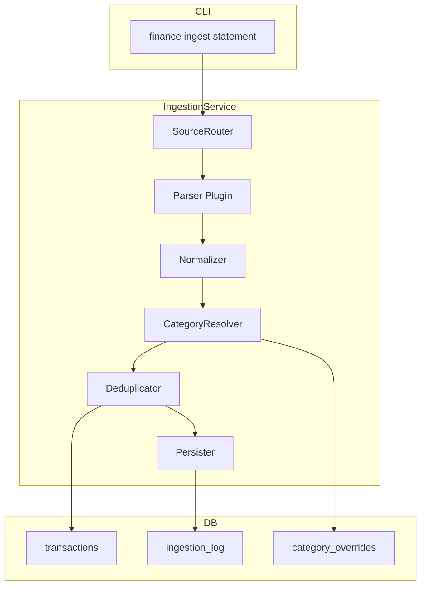

# Ingestion Service — Overview

**Phase**: 1 (MVP)

**Location**: `src/finance/ingestion/`

## Purpose

The Ingestion Service is responsible for everything that happens between a raw financial file (CSV, PDF, image) and a normalized transaction record in the database. It is the entry point for all financial data.

## Responsibilities

- Accept a file path and a source hint (bank name or "auto-detect")
- Route to the appropriate parser plugin
- Normalize raw parsed records into the canonical `Transaction` schema
- Apply category overrides (merchant pattern matching)
- Deduplicate against existing records in the database
- Persist new transactions and update the ingestion log
- Return a structured result (inserted count, skipped count, errors)

## Out of Scope (Phase 1)

- Real-time bank API polling (Phase 2+)
- Income/liability ingestion (Phase 2)
- Email attachment ingestion (Phase 2+)

## Architecture



## Module Structure

```
src/finance/ingestion/
├── __init__.py
├── service.py          # IngestionService — orchestrates the pipeline
├── router.py           # SourceRouter — selects parser based on source hint
├── normalizer.py       # Normalizer — raw → canonical Transaction
├── category.py         # CategoryResolver — applies overrides and defaults
├── deduplicator.py     # Deduplicator — checks for existing transactions
├── parsers/
│   ├── __init__.py
│   ├── base.py         # StatementParser ABC
│   ├── chase.py        # Chase credit card CSV
│   ├── wells_fargo.py  # Wells Fargo CSV
│   ├── frost.py        # Frost Bank CSV
│   ├── amex.py         # American Express CSV
│   ├── pnc.py          # PNC CSV
│   └── generic.py      # Generic CSV with auto-detect columns
└── models.py           # RawTransaction, IngestionResult (Pydantic)
```

## Parser Plugin Interface

All parsers implement the `StatementParser` abstract base class:

```python
class StatementParser(ABC):
    @property
    @abstractmethod
    def source_name(self) -> str:
        """Human-readable bank/source name."""

    @abstractmethod
    def can_parse(self, file_path: Path) -> bool:
        """Return True if this parser can handle the given file."""

    @abstractmethod
    def parse(self, file_path: Path) -> list[RawTransaction]:
        """Parse file and return raw transaction records."""
```

## Normalization

The `Normalizer` maps each bank's field names to the canonical schema:

| Canonical Field | Chase | Wells Fargo | Amex | Frost | PNC |
|-----------------|-------|-------------|------|-------|-----|
| `transaction_date` | `Transaction Date` | `Date` | `Date` | `Date` | `Date` |
| `description_raw` | `Description` | `Description` | `Description` | `Description` | `Description` |
| `amount` | `Amount` | `Amount` | `Amount` | `Amount` | `Amount` |
| `category_raw` | `Category` | `Category` | `Category` | *(none)* | `Category` |

Amount sign conventions differ by bank and are normalized to:

- **Positive** = money out (charge/debit)
- **Negative** = money in (credit/refund/payment)

Payments (autopay, balance transfers) are filtered out during normalization.

## Category Resolution

Categories are resolved in priority order:

1. **Merchant override**: Merchant pattern matches in `category_overrides` table (exact or regex)
2. **Bank category mapping**: Raw bank category → friendly category from `~/.finance/config.toml`
3. **Default**: If no mapping exists, the raw bank category is used as-is
4. **Fallback**: `"Uncategorized"` if no category is available

## Deduplication

A transaction is considered a duplicate if an existing record matches on all three of:

- `transaction_date`
- `amount`
- `description_raw` (normalized whitespace)

Duplicates are skipped and counted in `IngestionResult.skipped`.

## Ingestion Result

```python
@dataclass
class IngestionResult:
    source_file: str
    source_type: str
    records_parsed: int
    records_inserted: int
    records_skipped: int
    errors: list[str]
    duration_seconds: float
```

## Error Handling

- **ParseError**: Malformed CSV or unrecognized file — logged, user-facing message with suggested fix
- **ValidationError**: A row fails Pydantic validation (e.g., non-numeric amount) — row is skipped, error logged
- **DatabaseError**: DB write failure — transaction rolled back, full error reported

## Phase 2 Extensions

- Web UI drop-zone for file upload (replaces CLI file path argument)
- PDF statement parsing (bank statements with transaction tables)
- Email ingestion via IMAP
- Automatic re-categorization when override rules change
