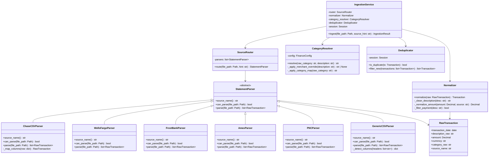
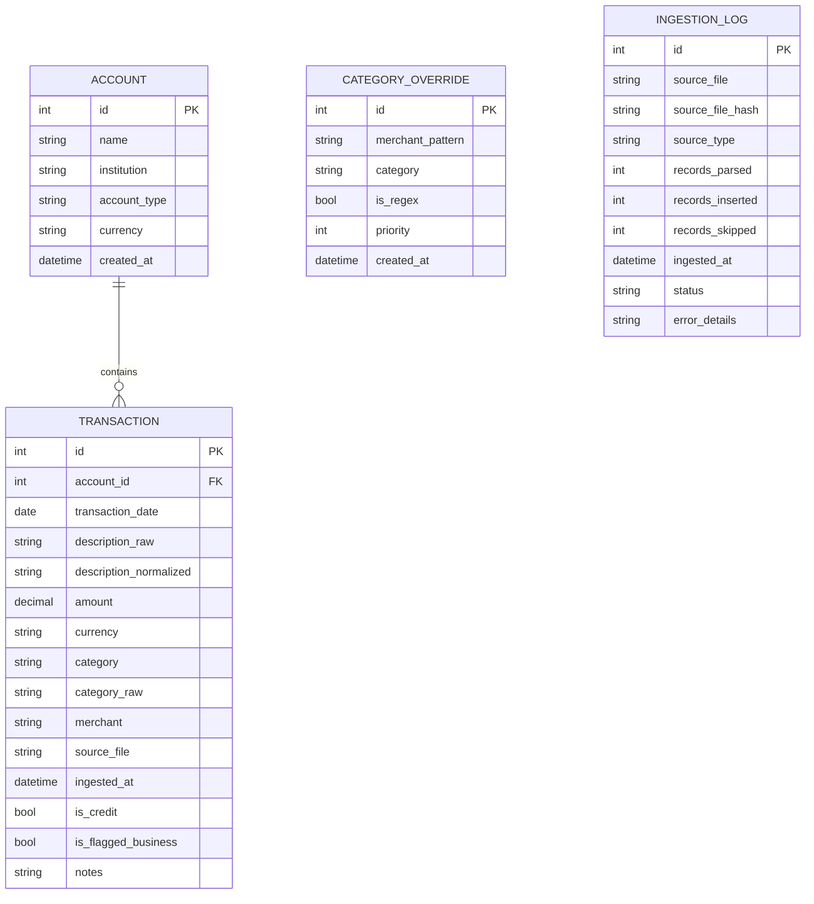
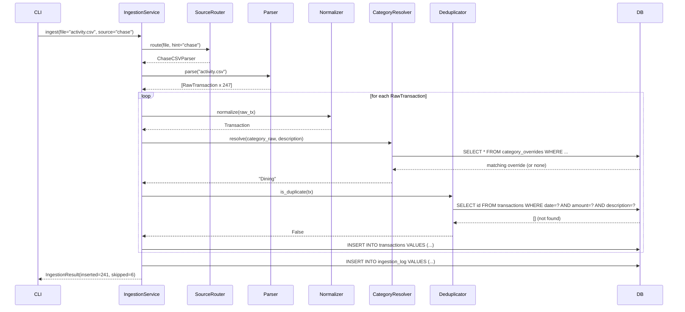

# Ingestion Service — Data Model & UML

## Class Diagram

```mermaid
classDiagram
    class StatementParser {
        <<abstract>>
        +source_name() str
        +can_parse(file_path: Path) bool
        +parse(file_path: Path) list~RawTransaction~
    }

    class ChaseCSVParser {
        +source_name() str
        +can_parse(file_path: Path) bool
        +parse(file_path: Path) list~RawTransaction~
        -_map_columns(row: dict) RawTransaction
    }

    class WellsFargoParser {
        +source_name() str
        +can_parse(file_path: Path) bool
        +parse(file_path: Path) list~RawTransaction~
    }

    class FrostBankParser {
        +source_name() str
        +can_parse(file_path: Path) bool
        +parse(file_path: Path) list~RawTransaction~
    }

    class AmexParser {
        +source_name() str
        +can_parse(file_path: Path) bool
        +parse(file_path: Path) list~RawTransaction~
    }

    class PNCParser {
        +source_name() str
        +can_parse(file_path: Path) bool
        +parse(file_path: Path) list~RawTransaction~
    }

    class GenericCSVParser {
        +source_name() str
        +can_parse(file_path: Path) bool
        +parse(file_path: Path) list~RawTransaction~
        -_detect_columns(headers: list~str~) dict
    }

    class SourceRouter {
        -parsers: list~StatementParser~
        +route(file_path: Path, hint: str) StatementParser
    }

    class RawTransaction {
        +transaction_date: date
        +description_raw: str
        +amount: Decimal
        +currency: str
        +category_raw: str
        +source_name: str
    }

    class Normalizer {
        +normalize(raw: RawTransaction) Transaction
        -_clean_description(desc: str) str
        -_normalize_amount(amount: Decimal, source: str) Decimal
        -_filter_payment(desc: str) bool
    }

    class CategoryResolver {
        -config: FinanceConfig
        +resolve(raw_category: str, description: str) str
        -_apply_merchant_override(description: str) str | None
        -_apply_category_map(raw_category: str) str
    }

    class Deduplicator {
        -session: Session
        +is_duplicate(tx: Transaction) bool
        +filter_new(transactions: list~Transaction~) list~Transaction~
    }

    class IngestionService {
        -router: SourceRouter
        -normalizer: Normalizer
        -category_resolver: CategoryResolver
        -deduplicator: Deduplicator
        -session: Session
        +ingest(file_path: Path, source_hint: str) IngestionResult
    }

    StatementParser <|-- ChaseCSVParser
    StatementParser <|-- WellsFargoParser
    StatementParser <|-- FrostBankParser
    StatementParser <|-- AmexParser
    StatementParser <|-- PNCParser
    StatementParser <|-- GenericCSVParser
    SourceRouter --> StatementParser
    IngestionService --> SourceRouter
    IngestionService --> Normalizer
    IngestionService --> CategoryResolver
    IngestionService --> Deduplicator
    StatementParser --> RawTransaction
    Normalizer --> RawTransaction
```

## Database Schema

```mermaid
erDiagram
    ACCOUNT {
        int id PK
        string name
        string institution
        string account_type
        string currency
        datetime created_at
    }

    TRANSACTION {
        int id PK
        int account_id FK
        date transaction_date
        string description_raw
        string description_normalized
        decimal amount
        string currency
        string category
        string category_raw
        string merchant
        string source_file
        datetime ingested_at
        bool is_credit
        bool is_flagged_business
        string notes
    }

    CATEGORY_OVERRIDE {
        int id PK
        string merchant_pattern
        string category
        bool is_regex
        int priority
        datetime created_at
    }

    INGESTION_LOG {
        int id PK
        string source_file
        string source_file_hash
        string source_type
        int records_parsed
        int records_inserted
        int records_skipped
        datetime ingested_at
        string status
        string error_details
    }

    ACCOUNT ||--o{ TRANSACTION : "contains"
```

## Sequence Diagram — Full Ingest Pipeline

```mermaid
sequenceDiagram
    participant CLI
    participant IngestionService
    participant SourceRouter
    participant Parser
    participant Normalizer
    participant CategoryResolver
    participant Deduplicator
    participant DB

    CLI->>IngestionService: ingest(file="activity.csv", source="chase")
    IngestionService->>SourceRouter: route(file, hint="chase")
    SourceRouter-->>IngestionService: ChaseCSVParser

    IngestionService->>Parser: parse("activity.csv")
    Parser-->>IngestionService: [RawTransaction x 247]

    loop for each RawTransaction
        IngestionService->>Normalizer: normalize(raw_tx)
        Normalizer-->>IngestionService: Transaction

        IngestionService->>CategoryResolver: resolve(category_raw, description)
        CategoryResolver->>DB: SELECT * FROM category_overrides WHERE ...
        DB-->>CategoryResolver: matching override (or none)
        CategoryResolver-->>IngestionService: "Dining"

        IngestionService->>Deduplicator: is_duplicate(tx)
        Deduplicator->>DB: SELECT id FROM transactions WHERE date=? AND amount=? AND description=?
        DB-->>Deduplicator: [] (not found)
        Deduplicator-->>IngestionService: False

        IngestionService->>DB: INSERT INTO transactions VALUES (...)
    end

    IngestionService->>DB: INSERT INTO ingestion_log VALUES (...)
    IngestionService-->>CLI: IngestionResult(inserted=241, skipped=6)
```
