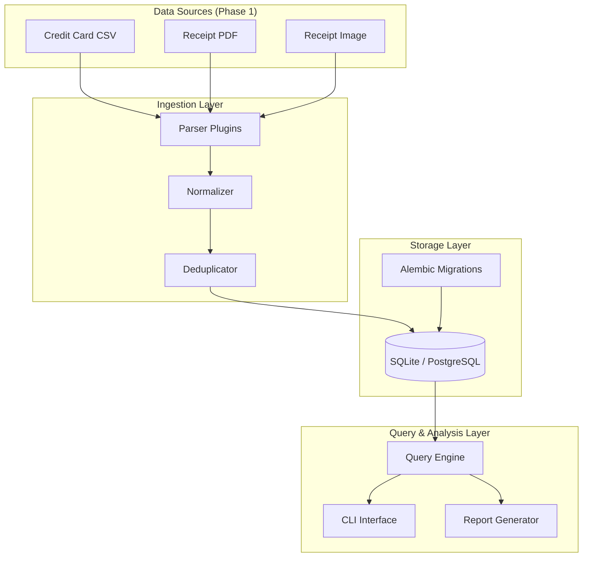
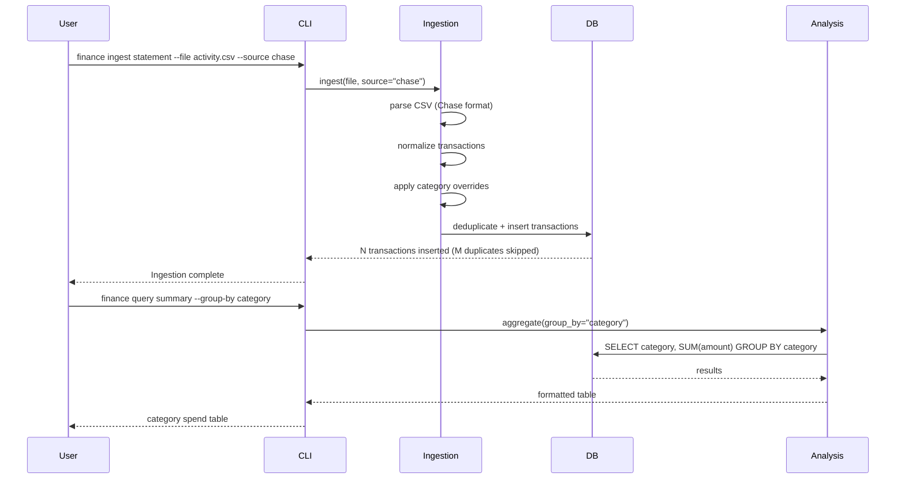
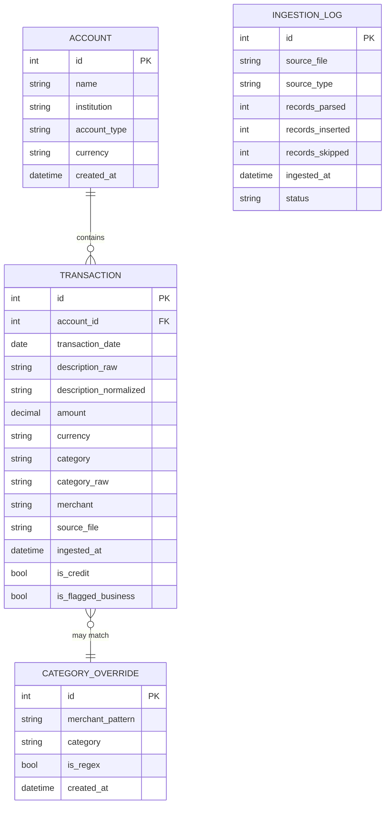

# System Overview

## Purpose

Finance Hub is a self-hosted personal finance management system. It ingests financial data from multiple sources (credit card statements, receipts, mortgage statements, tax documents), normalizes everything into a unified database, and provides tools for querying, categorizing, goal-tracking, and projecting your financial future.

## Architecture Philosophy

Finance Hub is built as a **modular monolith** in Phase 1 — a single Python application with well-defined internal module boundaries that are ready to be split into separate services in later phases if needed. This keeps Phase 1 simple while not creating architectural debt.

## Module Breakdown

### Phase 1 Modules

| Module | Location | Responsibility |
|--------|----------|----------------|
| Ingestion Service | `src/finance/ingestion/` | Parse statements and receipts, normalize, deduplicate, store |
| Analysis Service | `src/finance/analysis/` | Query engine, aggregations, report generation |
| CLI | `src/finance/cli/` | Command-line interface for all operations |
| Database | `src/finance/db/` | Schema models, migrations, session management |
| Common | `src/finance/common/` | Shared types, utilities, config |

### Phase 2 Additions (Planned)

| Module | Location | Responsibility |
|--------|----------|----------------|
| Goals Service | `src/finance/goals/` | Budget definitions, goal tracking, actuals comparison |
| Income Service | `src/finance/income/` | Income source tracking and ingestion |
| Liability Service | `src/finance/liabilities/` | Mortgage, loan tracking |
| Dashboard | `src/finance/dashboard/` | Web-based unified financial view |

### Phase 3 Additions (Planned)

| Module | Location | Responsibility |
|--------|----------|----------------|
| Trends Engine | `src/finance/trends/` | Rolling averages, YoY comparisons |
| Projection Engine | `src/finance/projections/` | Future cash flow modeling |
| Scenario Engine | `src/finance/scenarios/` | What-if scenario definitions and comparison |

## Data Flow — Phase 1

## Database Schema — Phase 1

## Phased Roadmap

### Phase 1 — Ingest, Store, Query (Current)

**Goal**: A working CLI tool that ingests real credit card data and lets you understand your spending.

**Deliverables**:

- Chase CSV parser (extensible to other banks)
- PDF/image receipt ingestion with OCR
- SQLite database with Alembic migrations
- CLI: `finance ingest`, `finance query`, `finance report`
- Interactive HTML spending report (Chart.js)
- Unit and integration tests
- This documentation

**Success Criteria**:

- Can ingest 12 months of Chase statements without errors
- Can query "how much did I spend on dining in Q1?" in under 1 second
- HTML report renders correctly in Chrome/Safari/Firefox

### Phase 2 — Goals, Budgets, Unified View (Planned)

**Goal**: A complete picture of all financial inflows and outflows, with goals and alerts.

**Deliverables**:

- Income source ingestion (salary, freelance, transfers)
- Mortgage/liability ingestion (manual/API, CSV, parser plugin hooks)
- Goal and budget definition API
- Budget vs. actual tracking
- Net cash flow + net worth dashboard (web UI)
- Over-budget indicators with persisted alert history
- Receipt-to-transaction matching
- Business expense flagging

**Success Criteria**:

- Can answer "am I on track with my savings goal?" at a glance
- Net cash flow for any month is accurate to within $10 of bank reconciliation
- Unified monthly summary (cash flow + net worth) reconciles within $10 operational tolerance

### Phase 3 — Trends, Projections, Scenarios (Planned)

**Goal**: Predictive and comparative financial intelligence.

**Deliverables**:

- Multi-period trend analysis (3-month, 12-month rolling)
- Year-over-year category comparison charts
- Scenario modeling engine (income change, new debt)
- 12–24 month projection charts
- Side-by-side scenario comparison
- Life event annotations

**Success Criteria**:

- Can model "what if I get a $10k raise starting in July" and see 12-month cash flow impact
- Year-over-year dining spend trend chart matches manual calculation

### Phase 4 — Crypto Portfolio Tracking (Planned)

**Goal**: Include cryptocurrency holdings in the unified financial picture.

**Deliverables**:

- Add self-custodied wallets by public address (BTC, ETH, SOL, and others)
- Coinbase API integration (read-only) for exchange-held balances
- Live USD valuation via CoinGecko price feed
- Portfolio value trend (historical snapshots over time)
- Unrealized gain/loss vs. cost basis
- Crypto section integrated into the net worth dashboard

**Success Criteria**:

- Can see total crypto portfolio value updated on demand
- Historical portfolio value chart shows 12-month trend
- Coinbase and self-custodied wallets shown in a single unified view

## Technology Stack Summary

See [Technology Decisions](technology-decisions.md) for detailed rationale.

| Layer | Technology | Rationale |
|-------|-----------|-----------|
| Language | Python 3.11+ | Rich ecosystem for data, excellent CSV/PDF libraries |
| ORM / DB | SQLAlchemy + SQLite | Simple local-first, upgradeable to Postgres |
| Migrations | Alembic | Industry-standard schema evolution |
| Validation | Pydantic v2 | Fast, typed data validation for parsed transactions |
| CLI | Click + Rich | Ergonomic CLI with beautiful terminal output |
| OCR | pytesseract / pdfminer | PDF and image receipt text extraction |
| Reports | Chart.js (CDN) | Interactive HTML charts, zero server dependency |
| Testing | pytest | Standard Python testing |
| Formatting | black + isort | Consistent, non-debatable style |
| Docs | MkDocs Material | Beautiful documentation from Markdown |
