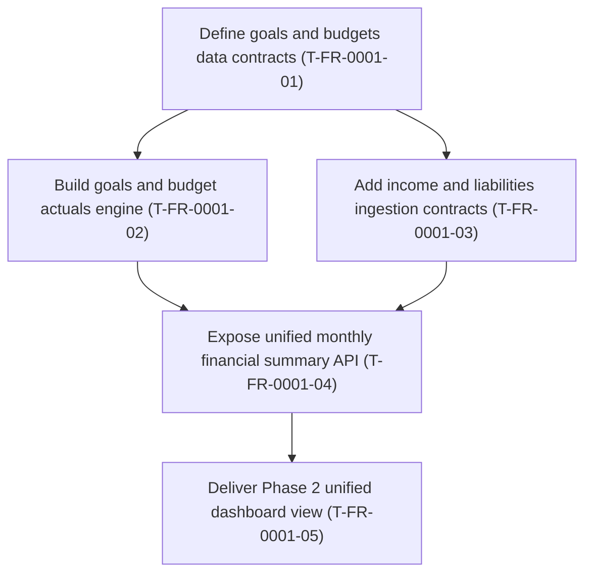

# FR-0001 — Work breakdown and DAG

## Ticket table

| ID | Title (required - human-facing name) | Type | Deps (ticket IDs) | Summary of change (1-2 lines) | Suggested order group | Link (optional) |
|----|----------------------------------------|------|---------------------|------------------------------|------------------------|-----------------|
| T-FR-0001-01 | Define goals and budgets data contracts | Story | none | Add API schemas, persistence model contracts, and validation boundaries for goals/budgets. | P0 foundation | [details](tickets.md#t-fr-0001-01---define-goals-and-budgets-data-contracts) |
| T-FR-0001-02 | Build goals and budget actuals engine | Story | T-FR-0001-01 | Implement actual-vs-budget and goal progress calculations using existing transaction data. | P1 | [details](tickets.md#t-fr-0001-02---build-goals-and-budget-actuals-engine) |
| T-FR-0001-03 | Add income and liabilities ingestion contracts | Story | T-FR-0001-01 | Introduce manual/API + CSV + parser-plugin ingestion contracts with create/update/soft-delete lifecycle support. | P1 | [details](tickets.md#t-fr-0001-03---add-income-and-liabilities-ingestion-contracts) |
| T-FR-0001-04 | Expose unified monthly financial summary API | Story | T-FR-0001-02, T-FR-0001-03 | Add endpoint combining inflow/outflow/liability, budget status, and full net worth breakdown with USD 10 reconciliation tolerance in VAL. | P2 | [details](tickets.md#t-fr-0001-04---expose-unified-monthly-financial-summary-api) |
| T-FR-0001-05 | Deliver Phase 2 unified dashboard view | Story | T-FR-0001-04 | Implement frontend unified view for goals, variance, cash flow, net worth, and both derived + persisted over-budget alerts. | P3 | [details](tickets.md#t-fr-0001-05---deliver-phase-2-unified-dashboard-view) |

**Parallelization rule:** Tickets with disjoint transitive ownership and all deps VAL-done can run in parallel.

## DAG (Mermaid)

## Map to feature `tickets.md` + global index

- Canonical `### T-FR-0001-xx` sections live in `tasks/feature-history/FR-0001-phase2-goals-unified-view/tickets.md`.
- Added this feature path to `tasks/feature-history/TICKET-SOURCES.md`.
- Added this feature row and graph edges to `docs/design/tickets-initial.md`.
- Added ticket rows to `tasks/ticket-progress.md`.

## Suggested `identify-frontier` check

Run `/identify-frontier` after this design handoff to validate the initial parallel-capable set.

## Decision alignment notes

- Ingestion scope includes manual/API entry, CSV, and parser-plugin hooks for liability and income records.
- Unified view includes full net worth breakdown in addition to cash flow and liability indicators.
- Over-budget behavior includes both derived indicators and persisted alert history.
- Reconciliation remains operational (USD 10 tolerance) for VAL, not strict accounting lockstep.
