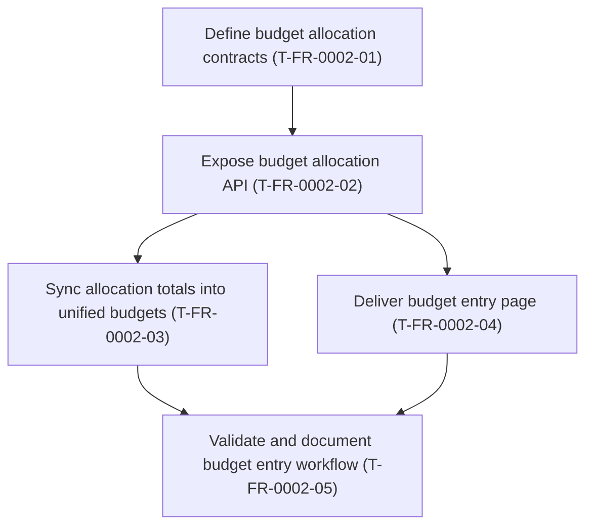

# FR-0002 — Work breakdown and DAG

## Ticket table

| ID | Title (required - human-facing name) | Type | Deps (ticket IDs) | Summary of change (1-2 lines) | Suggested order group | Link (optional) |
|----|----------------------------------------|------|---------------------|------------------------------|------------------------|-----------------|
| T-FR-0002-01 | Define budget allocation contracts | Story | T-FR-0001-05 | Add the design-backed schemas, persistence model, and cadence normalization contract for manual allocation plans and items. | P0 foundation | [details](tickets.md#t-fr-0002-01---define-budget-allocation-contracts) |
| T-FR-0002-02 | Expose budget allocation API | Story | T-FR-0002-01 | Add CRUD endpoints for allocation plans/items plus a summary endpoint for derived monthly totals. | P1 backend | [details](tickets.md#t-fr-0002-02---expose-budget-allocation-api) |
| T-FR-0002-03 | Sync allocation totals into unified budgets | Story | T-FR-0002-02 | Derive category/month budget rows from allocation items so existing budget actuals and unified summary behavior reflect saved plans. | P2 integration | [details](tickets.md#t-fr-0002-03---sync-allocation-totals-into-unified-budgets) |
| T-FR-0002-04 | Deliver budget entry page | Story | T-FR-0002-02 | Add the React page, navigation, API client/types, editable rows, and summary cards for manual allocation entry. | P2 frontend | [details](tickets.md#t-fr-0002-04---deliver-budget-entry-page) |
| T-FR-0002-05 | Validate and document budget entry workflow | Story | T-FR-0002-03, T-FR-0002-04 | Run Docker-based backend/frontend validation, document usage, and prepare implementation handoff/closeout. | P3 validation | [details](tickets.md#t-fr-0002-05---validate-and-document-budget-entry-workflow) |

**Parallelization rule:** Tickets with disjoint transitive ownership and all deps VAL-done can run in parallel.

## DAG (Mermaid)

## Map to feature `tickets.md` + global index

- Canonical `### T-FR-0002-xx` sections live in `tasks/feature-history/FR-0002-budget-entry-page/tickets.md`.
- Add this feature path to `tasks/feature-history/TICKET-SOURCES.md`.
- Add this feature row and graph edges to `docs/design/tickets-initial.md`.
- Add ticket rows to `tasks/ticket-progress.md`.

## Suggested `identify-frontier` check

Run `/identify-frontier` after this design handoff to validate that **Define budget allocation contracts** (`T-FR-0002-01`) is the initial eligible ticket because **Deliver Phase 2 unified dashboard view** (`T-FR-0001-05`) is already VAL-done.

## Decision alignment notes

- Manual entry is the first implementation target.
- The sample spreadsheet informs content requirements only, not Finance Hub product language or visual design.
- Allocation items preserve planning detail while derived category budgets keep the FR-0001 actuals engine and unified view as the read-side contract.
- Spreadsheet import, multiple scenarios, and persisted alert history remain follow-up candidates.
