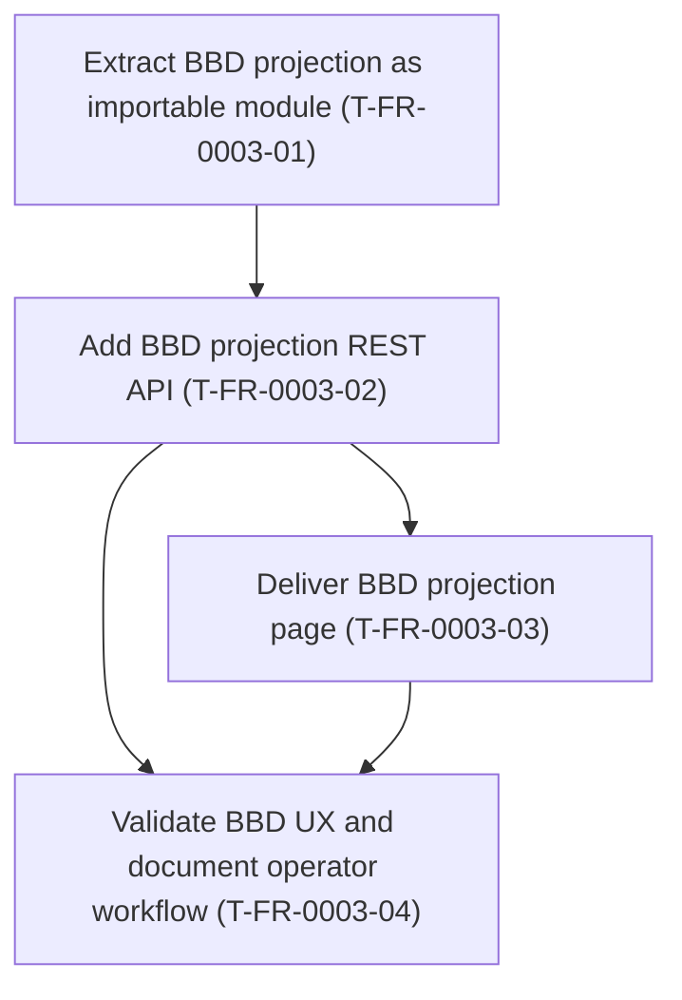

# FR-0003 — Work breakdown and DAG

## Ticket table

| ID | Title (required — human-facing name) | Type | Deps (ticket IDs) | Summary of change (1–2 lines) | Suggested order group | Link |
|----|----------------------------------------|------|-------------------|-------------------------------|----------------------|------|
| T-FR-0003-01 | Extract BBD projection as importable module | Story/Task | none | Move core types, `project`, Monte Carlo, and estate helpers into `src/`; keep CLI in `scripts/bbd_projection.py` as thin wrapper | P0 | [details](tickets.md#t-fr-000301--extract-bbd-projection-as-importable-module) |
| T-FR-0003-02 | Add BBD projection REST API | Story/Task | T-FR-0003-01 | `POST /api/bbd-projection/run` with Pydantic request/response, validation, Monte Carlo caps, tests | P1 | [details](tickets.md#t-fr-000302--add-bbd-projection-rest-api) |
| T-FR-0003-03 | Deliver BBD projection page | Story/Task | T-FR-0003-02 | React page + API client + nav; form for scenario JSON, results table/charts, disclaimers | P2 | [details](tickets.md#t-fr-000303--deliver-bbd-projection-page) |
| T-FR-0003-04 | Validate BBD UX and document operator workflow | Story/Task | T-FR-0003-02, T-FR-0003-03 | Docker dev-stack check; update `scripts/README.md` pointer; MkDocs/nav if applicable | P3 | [details](tickets.md#t-fr-000304--validate-bbd-ux-and-document-operator-workflow) |

## DAG (Mermaid)

## Map to canonical `tickets.md` + trackers

Promotion complete when `tickets.md` **`###`** sections and **`ticket-progress.md`** rows match this DAG.
