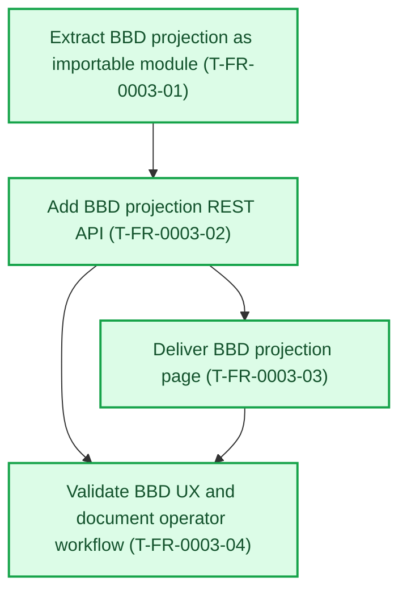

# FR-0003 — Work breakdown and DAG

Status colors: **green** means fully verified, **yellow** means work is underway,
and **red** means outstanding or waiting on earlier work. The feature integration
owner refreshes this graph before dispatch and after every wave.

## Canonical DAG

```mermaid
flowchart TB
  T01["Extract BBD projection as importable module (T-FR-0003-01)"]
  T02["Add BBD projection REST API (T-FR-0003-02)"]
  T03["Deliver BBD projection page (T-FR-0003-03)"]
  T04["Validate BBD UX and document operator workflow (T-FR-0003-04)"]
  T01 --> T02
  T02 --> T03
  T02 --> T04
  T03 --> T04

  classDef completed fill:#dcfce7,stroke:#16a34a,color:#14532d,stroke-width:2px
  classDef inDevelopment fill:#fef3c7,stroke:#d97706,color:#78350f,stroke-width:2px
  classDef outstanding fill:#fee2e2,stroke:#dc2626,color:#7f1d1d,stroke-width:2px
  class T01,T02,T03,T04 completed
```

<!-- ticket-dag-status:start -->
**Where things stand:** Across the project, 21 of 41 defined tickets are fully verified; 20 remain open or are not yet recorded as complete. Bbd projection ui (FR-0003) is complete: all 4 tickets are fully verified.
<!-- ticket-dag-status:end -->

## Ticket table

| ID | Title (required — human-facing name) | Type | Needs first (title + stable ID) | Summary of change (1–2 lines) | Suggested order group | Link |
|----|----------------------------------------|------|-------------------|-------------------------------|----------------------|------|
| T-FR-0003-01 | Extract BBD projection as importable module | Story/Task | Nothing — can start immediately | Move core types, `project`, Monte Carlo, and estate helpers into `src/`; keep CLI in `scripts/bbd_projection.py` as thin wrapper | P0 | [details](tickets.md#t-fr-000301--extract-bbd-projection-as-importable-module) |
| T-FR-0003-02 | Add BBD projection REST API | Story/Task | Extract BBD projection as importable module (T-FR-0003-01) | `POST /api/bbd-projection/run` with Pydantic request/response, validation, Monte Carlo caps, tests | P1 | [details](tickets.md#t-fr-000302--add-bbd-projection-rest-api) |
| T-FR-0003-03 | Deliver BBD projection page | Story/Task | Add BBD projection REST API (T-FR-0003-02) | React page + API client + nav; form for scenario JSON, results table/charts, disclaimers | P2 | [details](tickets.md#t-fr-000303--deliver-bbd-projection-page) |
| T-FR-0003-04 | Validate BBD UX and document operator workflow | Story/Task | Add BBD projection REST API (T-FR-0003-02); Deliver BBD projection page (T-FR-0003-03) | Docker dev-stack check; update `scripts/README.md` pointer; MkDocs/nav if applicable | P3 | [details](tickets.md#t-fr-000304--validate-bbd-ux-and-document-operator-workflow) |

## Map to canonical `tickets.md` + trackers

Promotion complete when `tickets.md` **`###`** sections and **`ticket-progress.md`** rows match this DAG.
