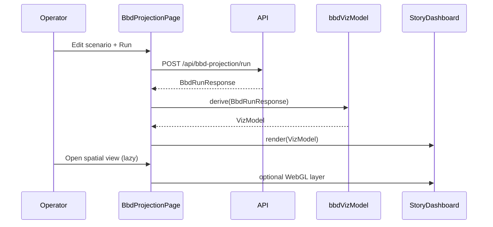

# FR-0004 — Design (level 0, skeleton)

## Purpose

Elevate the BBD page from **tabular diagnostics** to an **explainable, visual experience**: readers learn the Buy / Borrow / Die *mechanics* while exploring **`BbdRunResponse`** data (schedule, estate paths, Monte summary). Layout emphasizes **narrative + charts**; **sticky bottom dock** centralizes **documentation** and **report/export** actions.

## Actors

- **Learner / operator** — edits scenario, runs projection, reads insights.
- **Frontend SPA** — transforms API payloads client-side; optional future server aggregates only if **`DESIGN-GAP`** appears.

## Public surfaces (skeleton)

Only contracts: routes unchanged (**`POST /api/bbd-projection/run`**, **`GET /api/bbd-projection/default-scenario`**). New **UI modules** (logical owner: frontend BBD feature folder).

| Surface | Kind | Contract (signature / schema sketch) | Owner (logical) |
|---------|------|----------------------------------------|-----------------|
| `BbdControlDock` | React component | Props: `onOpenDocs`, `onGenerateReport`, `runState`, `primaryAction` slot; fixed `bottom` positioning, safe-area padding, z-index above content not above modal layer | UI |
| `bbdVizModel` | Pure TS module | **In:** `BbdRunResponse`, optional scenario snapshot for labels. **Out:** chart-ready series (`{ t, nw, age, ltv, … }`), estate compare tuples, Monte chip metrics, **phase annotations** (e.g. borrow-heavy years) | Frontend lib |
| `BbdStoryDashboard` | React composition | Renders 2D **`recharts`** charts + collapsible table; receives model + education slots | UI |
| `BbdSpatialView` | React lazy bundle | **In:** same model. **Out:** WebGL scene (`@react-three/fiber`) — e.g. path in (**year**, **net worth**, **alt metric**) space; **time scrubber** = “4th dimension” control. Loaded with `React.lazy` + fallback skeleton | UI |
| `BbdInsightRail` | React component | Contextual teach blocks keyed by chart id or simulation phase; pulls copy from extended **`bbdFieldTips`**-style map or MD fragments | Content |

## Data in / out

| Input | Output | Storage |
|-------|--------|---------|
| Existing **`BbdRunResponse`** (`schedule`, `estate_*`, `monte_carlo`, `bbd_net_advantage_vs_sell_path`) | Derived **immutable** view models for charts (no second API round-trip) | React state / memoized selectors only |
| Scenario fields (for narrative: ages, horizon) | Labels on axes and insight templates | Existing scenario state |

## Visualization stack (decision)

- **2D:** **`recharts`** (already in **`frontend/package.json`**) — line/area/composed charts, responsive containers.
- **3D / spatial:** **`three`**, **`@react-three/fiber`**, **`@react-three/drei`** — single lazy route section or toggle “Spatial view” to cap main-bundle growth.
- **Pedagogy:** reuse patterns from **`BbdGuideContent`**, **`bbdFieldTips`**, **`OUTPUT_TIPS`** — extend with **short lesson blocks** and **links** to repo docs (`scripts/bbd-projection/README.md`, especially the Strategy appendix) without duplicating legal disclaimers.

## Open questions

- **DESIGN-GAP (optional):** If client-side transforms cannot produce a desired aggregate cheaply (e.g. full trial paths), specify a **`GET`** enrichment — **out of scope** until profiling proves necessary.
- **A11y:** 3D view must have **non-WebGL fallback** (same data as 2D list + summary) and **reduced motion** respect (`prefers-reduced-motion` → disable camera drift / auto-spin).

## Sequence (high level)

