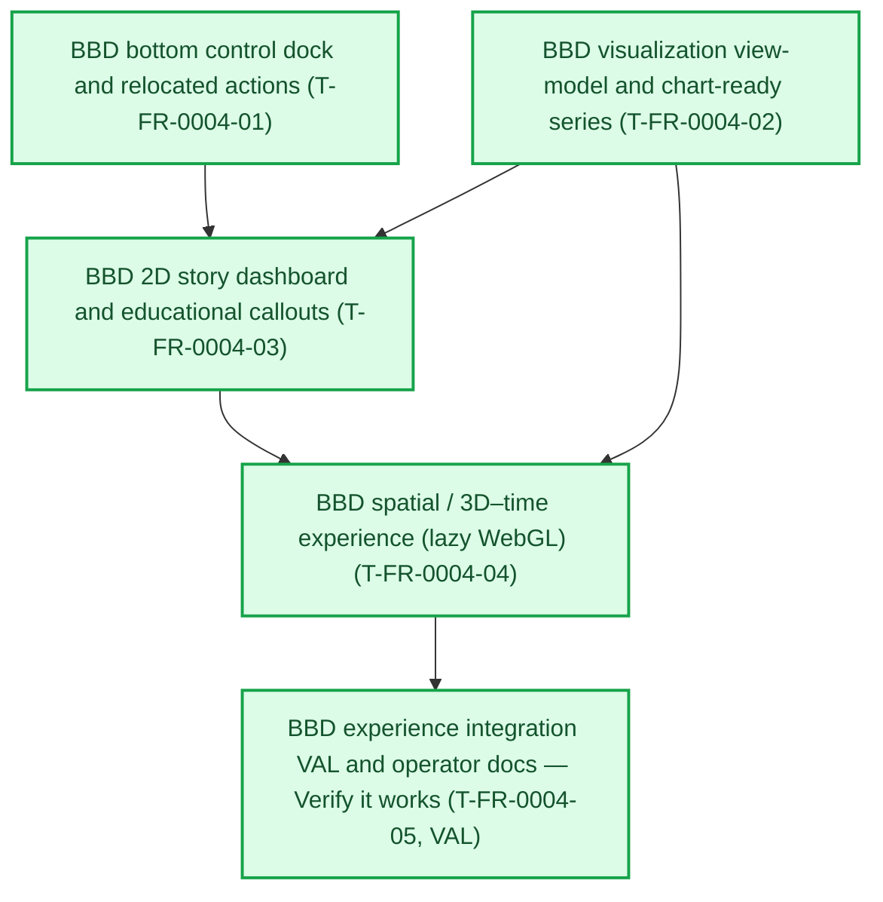

# FR-0004 — Work breakdown and DAG

Status colors: **green** means fully verified, **yellow** means work is underway,
and **red** means outstanding or waiting on earlier work. The feature integration
owner refreshes this graph before dispatch and after every wave.

## Canonical DAG

<!-- ticket-dag-status:start -->
**Where things stand:** Across the project, 21 of 41 defined tickets are fully verified; 20 remain open or are not yet recorded as complete. Bbd projection experience (FR-0004) is complete: all 5 tickets are fully verified.
<!-- ticket-dag-status:end -->

## Ticket table

| ID | Title (required — human-facing name) | Type | Needs first (title + stable ID) | Summary of change (1–2 lines) | Suggested order group | Link (optional) |
|----|----------------------------------------|------|---------------------|------------------------------|------------------------|-------------------|
| T-FR-0004-01 | BBD bottom control dock and relocated actions | Story | Nothing — can start immediately | Fixed bottom-center **control dock**; move **Docs** + **Generate report** (and aligned primary actions) into the dock; responsive safe-area and z-index rules | P0 foundation | [details](tickets.md#t-fr-0004-01--bbd-bottom-control-dock-and-relocated-actions) |
| T-FR-0004-02 | BBD visualization view-model and chart-ready series | Story | Nothing — can start immediately | Pure TS **`bbdVizModel`** (or equivalent): map **`BbdScheduleRow`** → time series, estate comparison structs, Monte summaries, optional **phase hints**; **vitest** for transforms | P0 foundation | [details](tickets.md#t-fr-0004-02--bbd-visualization-view-model-and-chart-ready-series) |
| T-FR-0004-03 | BBD 2D story dashboard and educational callouts | Story | BBD bottom control dock and relocated actions (T-FR-0004-01); BBD visualization view-model and chart-ready series (T-FR-0004-02) | **`recharts`** surfaces (NW trajectory, leverage/LTV, income/tax delta story, estate bars, Monte chips); collapsible table; **Insight** callouts tied to mechanics | P1 experience | [details](tickets.md#t-fr-0004-03--bbd-2d-story-dashboard-and-educational-callouts) |
| T-FR-0004-04 | BBD spatial / 3D–time experience (lazy WebGL) | Story | BBD visualization view-model and chart-ready series (T-FR-0004-02); BBD 2D story dashboard and educational callouts (T-FR-0004-03) | Lazy **`@react-three/fiber`** scene: spatial trajectory + **time scrubber** (4D navigation); **`prefers-reduced-motion`** fallback to 2D-only | P1 experience | [details](tickets.md#t-fr-0004-04--bbd-spatial--3d-time-experience-lazy-webgl) |
| T-FR-0004-05 | BBD experience integration VAL and operator docs | Story | BBD spatial / 3D–time experience (lazy WebGL) (T-FR-0004-04) | Bundle/perf check, a11y pass, update **`scripts/README.md`** or feature notes if export path UX changes; finalize Vitest coverage for model | P2 ship | [details](tickets.md#t-fr-0004-05--bbd-experience-integration-val-and-operator-docs) |

**Parallelization:** **`T-FR-0004-01`** and **`T-FR-0004-02`** may run in parallel (disjoint ownership: chrome vs pure lib). **`T-FR-0004-03`** follows both. **`T-FR-0004-04`** can start once **`T-FR-0004-02`** is VAL-done and **`T-FR-0004-03`** is DEV-complete for layout anchors (or stricter: full VAL on **`T-FR-0004-03`** — ticket body uses **Deps** as written).

## Map to feature **`tickets.md`** + global index

- Promoted: canonical **`###`** sections in [`tickets.md`](tickets.md).
- Global DAG: [`docs/design/tickets-initial.md`](../../../docs/design/tickets-initial.md) extended with **`FR-0004`** triads.
- Progress: [`tasks/ticket-progress.md`](../../../tasks/ticket-progress.md).
