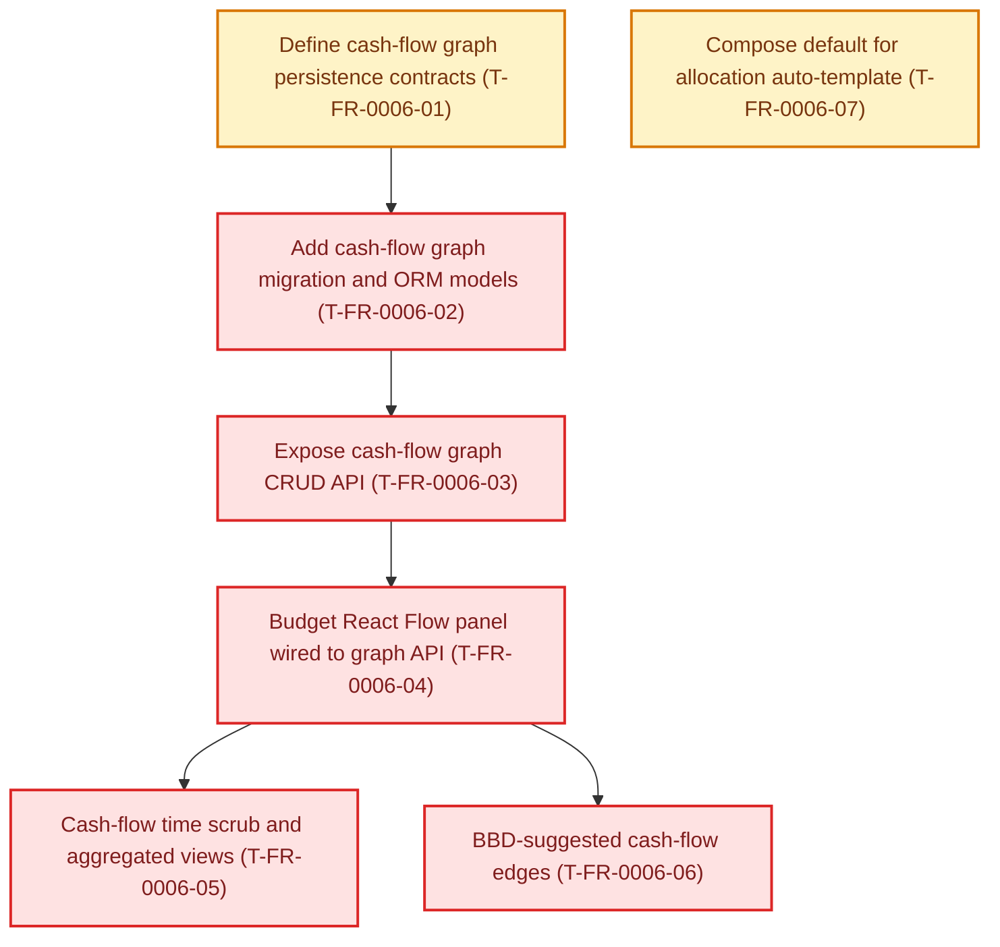

# FR-0006 — Work breakdown and DAG

Status colors: **green** means fully verified, **yellow** means work is underway,
and **red** means outstanding or waiting on earlier work. The feature integration
owner refreshes this graph before dispatch and after every wave.

## Canonical DAG

<!-- ticket-dag-status:start -->
**Where things stand:** Across the project, 21 of 41 defined tickets are fully verified; 20 remain open or are not yet recorded as complete. For Budget cash flow graph (FR-0006), 0 of 7 tickets are fully verified; work is underway on Define cash-flow graph persistence contracts (T-FR-0006-01).
<!-- ticket-dag-status:end -->

## Ticket table

| ID | Title (required — human-facing name) | Type | Needs first (title + stable ID) | Summary of change (1–2 lines) | Suggested order group | Link |
|----|----------------------------------------|------|---------------------|------------------------------|------------------------|------|
| T-FR-0006-01 | Define cash-flow graph persistence contracts | Story | Expose budget allocation API (T-FR-0002-02) | Pydantic + enums + versioning/scope rules; ties to allocation plan/month per decision | P0 | [tickets.md](tickets.md) |
| T-FR-0006-02 | Add cash-flow graph migration and ORM models | Story | Define cash-flow graph persistence contracts (T-FR-0006-01) | SQL migration + SQLAlchemy `CashNode` / `CashFlowEdge` (and join keys) | P0 | [tickets.md](tickets.md) |
| T-FR-0006-03 | Expose cash-flow graph CRUD API | Story | Add cash-flow graph migration and ORM models (T-FR-0006-02) | FastAPI routes: read/replace graph for scoped plan; pytest + OpenAPI | P1 | [tickets.md](tickets.md) |
| T-FR-0006-04 | Budget React Flow panel wired to graph API | Story | Expose cash-flow graph CRUD API (T-FR-0006-03) | `@xyflow/react` panel on Budget: load, edit, save; validation UX | P1 | [tickets.md](tickets.md) |
| T-FR-0006-05 | Cash-flow time scrub and aggregated views | Story | Budget React Flow panel wired to graph API (T-FR-0006-04) | Day/month/year controls; optional snapshot materialization per design | P2 | [tickets.md](tickets.md) |
| T-FR-0006-06 | BBD-suggested cash-flow edges | Story | Budget React Flow panel wired to graph API (T-FR-0006-04); Add BBD projection REST API (T-FR-0003-02) | Explicit API/UI to propose edges from projection outputs; no silent coupling | P3 | [tickets.md](tickets.md) |
| T-FR-0006-07 | Compose default for allocation auto-template | Task | Nothing — can start immediately | Set or document **`FINANCE_ALLOCATION_AUTO_TEMPLATE`** default for prod-like vs dev workflows | P1 | [tickets.md](tickets.md) |

**Parallel note:** **T-FR-0006-07** may run in parallel with **T-FR-0006-01** (disjoint ownership: Compose/docs vs contracts).

## Map to trackers

- Canonical sections: **[`tickets.md`](tickets.md)**.
- Global index: **[`docs/design/tickets-initial.md`](../../../docs/design/tickets-initial.md)**.
- Progress rows: **[`tasks/ticket-progress.md`](../../ticket-progress.md)**.

## Suggested `identify-frontier` check

After the first commits land, run **`/identify-frontier`** — expect **T-FR-0006-01** and **T-FR-0006-07** as the initial parallel-capable set once **T-FR-0002-02** is **VAL** `done`.
