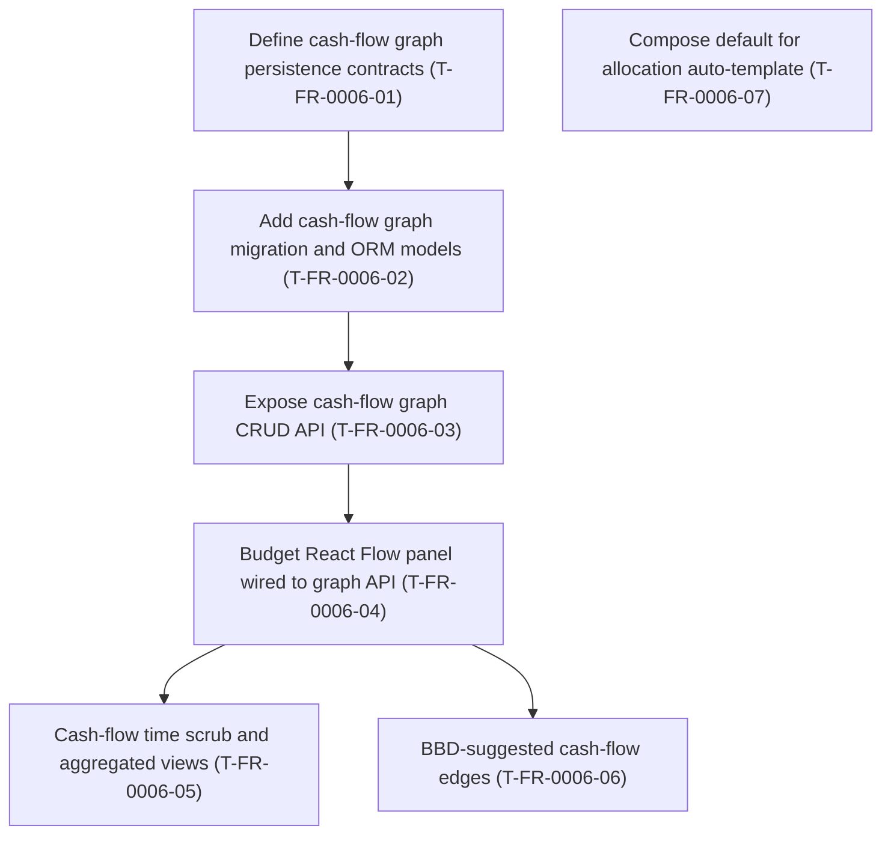
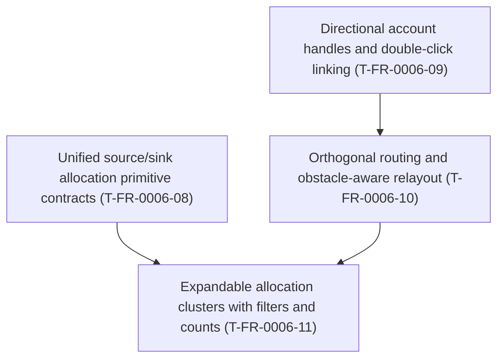

# FR-0006 — Work breakdown and DAG

## Ticket table

| ID | Title (required — human-facing name) | Type | Deps (ticket IDs) | Summary of change (1–2 lines) | Suggested order group | Link |
|----|----------------------------------------|------|---------------------|------------------------------|------------------------|------|
| T-FR-0006-01 | Define cash-flow graph persistence contracts | Story | `T-FR-0002-02` | Pydantic + enums + versioning/scope rules; ties to allocation plan/month per decision | P0 | [tickets.md](tickets.md) |
| T-FR-0006-02 | Add cash-flow graph migration and ORM models | Story | `T-FR-0006-01` | SQL migration + SQLAlchemy `CashNode` / `CashFlowEdge` (and join keys) | P0 | [tickets.md](tickets.md) |
| T-FR-0006-03 | Expose cash-flow graph CRUD API | Story | `T-FR-0006-02` | FastAPI routes: read/replace graph for scoped plan; pytest + OpenAPI | P1 | [tickets.md](tickets.md) |
| T-FR-0006-04 | Budget React Flow panel wired to graph API | Story | `T-FR-0006-03` | `@xyflow/react` panel on Budget: load, edit, save; validation UX | P1 | [tickets.md](tickets.md) |
| T-FR-0006-05 | Cash-flow time scrub and aggregated views | Story | `T-FR-0006-04` | Day/month/year controls; optional snapshot materialization per design | P2 | [tickets.md](tickets.md) |
| T-FR-0006-06 | BBD-suggested cash-flow edges | Story | `T-FR-0006-04`, `T-FR-0003-02` | Explicit API/UI to propose edges from projection outputs; no silent coupling | P3 | [tickets.md](tickets.md) |
| T-FR-0006-07 | Compose default for allocation auto-template | Task | none | Set or document **`FINANCE_ALLOCATION_AUTO_TEMPLATE`** default for prod-like vs dev workflows | P1 | [tickets.md](tickets.md) |

## DAG (Mermaid)

**Parallel note:** **T-FR-0006-07** may run in parallel with **T-FR-0006-01** (disjoint ownership: Compose/docs vs contracts).

## Map to trackers

- Canonical sections: **[`tickets.md`](tickets.md)**.
- Global index: **[`docs/design/tickets-initial.md`](../../../docs/design/tickets-initial.md)**.
- Progress rows: **[`tasks/ticket-progress.md`](../../ticket-progress.md)**.

## Suggested `identify-frontier` check

After the first commits land, run **`/identify-frontier`** — expect **T-FR-0006-01** and **T-FR-0006-07** as the initial parallel-capable set once **T-FR-0002-02** is **VAL** `done`.

---

## Expansion addendum — 2026-06-29 account routing and allocation primitives

Addendum: [`30-expand-2026-06-29-account-routing-allocations.md`](30-expand-2026-06-29-account-routing-allocations.md).

| ID | Title (required — human-facing name) | Type | Deps (ticket IDs) | Summary of change (1–2 lines) | Suggested order group | Link |
|----|----------------------------------------|------|---------------------|------------------------------|------------------------|------|
| T-FR-0006-08 | Unified source/sink allocation primitive contracts | Story | `T-FR-0006-03` | Extend allocation rows into explicit source or sink primitives with plan-local account endpoints and summary semantics | P0 | [tickets.md](tickets.md) |
| T-FR-0006-09 | Directional account handles and double-click linking | Story | `T-FR-0006-04` | Replace top/bottom handles with left input/right output handles, node roles, and a double-click account-link flow | P0 | [tickets.md](tickets.md) |
| T-FR-0006-10 | Orthogonal routing and obstacle-aware relayout | Story | `T-FR-0006-09` | Generate square, non-overlapping edge routes and rerun layout after graph structure changes | P1 | [tickets.md](tickets.md) |
| T-FR-0006-11 | Expandable allocation clusters with filters and counts | Story | `T-FR-0006-08`, `T-FR-0006-10` | Show linked allocation counts on accounts; expand filtered allocation mini-nodes beneath accounts and relayout on filter changes | P1 | [tickets.md](tickets.md) |

**Parallel note:** **T-FR-0006-08** and **T-FR-0006-09** can begin together once the feature branch is current. **T-FR-0006-10** should wait for the directional-handle shape, and **T-FR-0006-11** should wait for both allocation endpoints and routing/relayout helpers.
