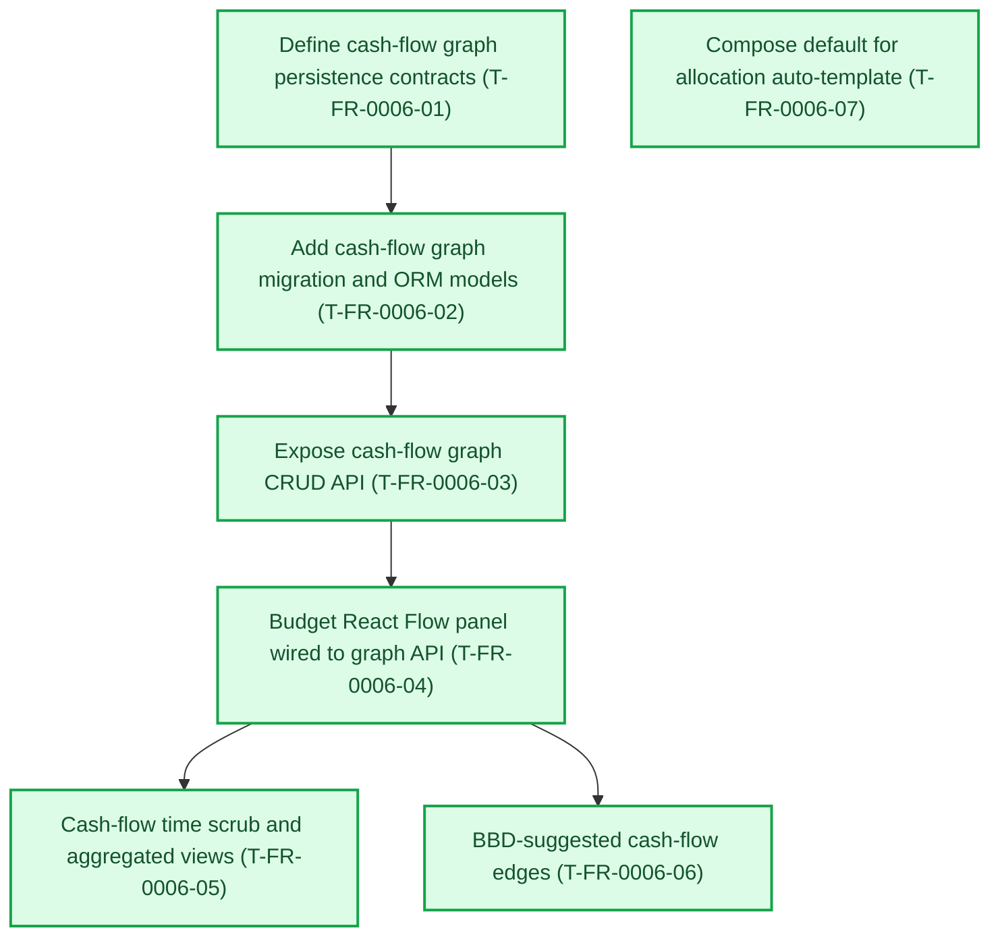
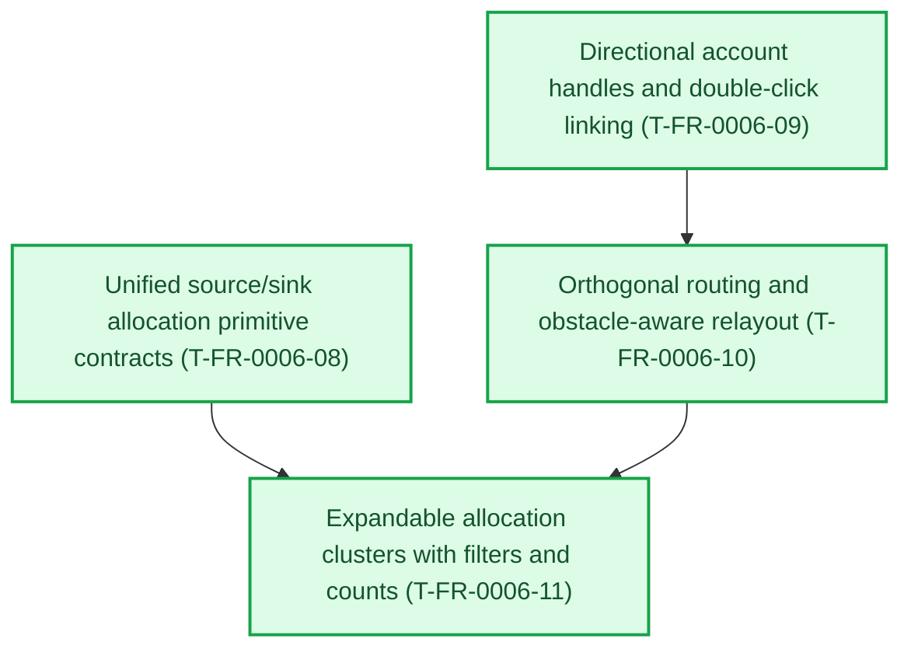
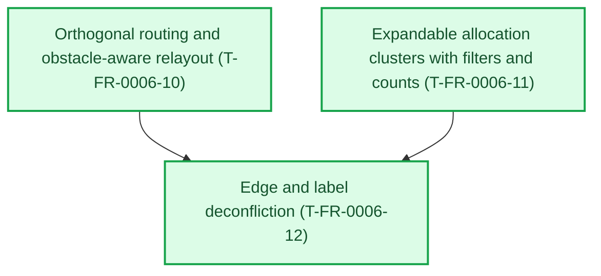
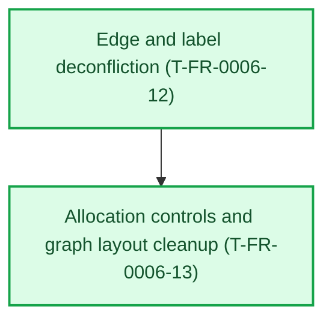
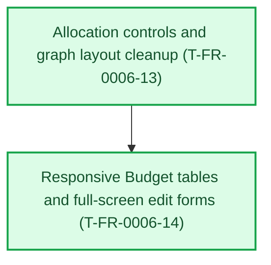

# FR-0006 — Work breakdown and DAG

Status colors: **green** means fully verified, **yellow** means work is underway,
and **red** means outstanding or waiting on earlier work. The feature integration
owner refreshes this graph before dispatch and after every wave.

## Canonical DAG

<!-- ticket-dag-status:start -->
**Where things stand:** Across the project, 35 of 48 defined tickets are fully verified; 13 remain open or are not yet recorded as complete. Budget cash flow graph (FR-0006) is complete: all 14 tickets are fully verified.
<!-- ticket-dag-status:end -->

## Ticket table

| ID | Title (required — human-facing name) | Type | Needs first (title + stable ID) | Summary of change (1–2 lines) | Suggested order group | Link |
|----|----------------------------------------|------|---------------------|------------------------------|------------------------|------|
| T-FR-0006-01 | Define cash-flow graph persistence contracts | Story | Expose budget allocation API (T-FR-0002-02) | Pydantic + enums + versioning/scope rules; ties to allocation plan/month per decision | P0 | [tickets.md](tickets.md) |
| T-FR-0006-02 | Add cash-flow graph migration and ORM models | Story | Define cash-flow graph persistence contracts (T-FR-0006-01) | SQL migration + SQLAlchemy `CashNode` / `CashFlowEdge` (and join keys) | P0 | [tickets.md](tickets.md) |
| T-FR-0006-03 | Expose cash-flow graph CRUD API | Story | Add cash-flow graph migration and ORM models (T-FR-0006-02) | FastAPI routes: read/replace graph for scoped plan; pytest + OpenAPI | P1 | [tickets.md](tickets.md) |
| T-FR-0006-04 | Budget React Flow panel wired to graph API | Story | Expose cash-flow graph CRUD API (T-FR-0006-03) | `@xyflow/react` panel on Budget: load, edit, save; validation UX | P1 | [tickets.md](tickets.md) |
| T-FR-0006-05 | Cash-flow time scrub and aggregated views | Story | Budget React Flow panel wired to graph API (T-FR-0006-04) | Day/month/year controls; optional snapshot materialization per design | P2 | [tickets.md](tickets.md) |
| T-FR-0006-06 | BBD-suggested cash-flow edges | Story | Budget React Flow panel wired to graph API (T-FR-0006-04); Add BBD projection REST API (T-FR-0003-02) | Explicit API/UI to propose edges from projection outputs; no silent coupling | P3 | [tickets.md](tickets.md) |
| T-FR-0006-07 | Compose default for allocation auto-template | Task | Nothing — can start immediately | Set or document **`FINANCE_ALLOCATION_AUTO_TEMPLATE`** default for prod-like vs dev workflows | P1 | [tickets.md](tickets.md) |

**Parallel note:** **T-FR-0006-07** may run in parallel with **T-FR-0006-01** (disjoint ownership: Compose/docs vs contracts).

## Map to trackers

- Canonical sections: **[`tickets.md`](tickets.md)**.
- Global index: **[`docs/design/tickets-initial.md`](../../../docs/design/tickets-initial.md)**.
- Progress rows: **[`tasks/ticket-progress.md`](../../ticket-progress.md)**.

## Suggested `identify-frontier` check

After the first commits land, run **`/identify-frontier`** — expect **T-FR-0006-01** and **T-FR-0006-07** as the initial parallel-capable set once **T-FR-0002-02** is **VAL** `done`.

---

## Expansion addendum — 2026-06-29 account routing and allocation primitives

Addendum: [`30-expand-2026-06-29-account-routing-allocations.md`](30-expand-2026-06-29-account-routing-allocations.md).

| ID | Title (required — human-facing name) | Type | Needs first (title + stable ID) | Summary of change (1–2 lines) | Suggested order group | Link |
|----|----------------------------------------|------|---------------------|------------------------------|------------------------|------|
| T-FR-0006-08 | Unified source/sink allocation primitive contracts | Story | Expose cash-flow graph CRUD API (T-FR-0006-03) | Extend allocation rows into explicit source or sink primitives with plan-local account endpoints and summary semantics | P0 | [tickets.md](tickets.md) |
| T-FR-0006-09 | Directional account handles and double-click linking | Story | Budget React Flow panel wired to graph API (T-FR-0006-04) | Replace top/bottom handles with left input/right output handles, node roles, and a double-click account-link flow | P0 | [tickets.md](tickets.md) |
| T-FR-0006-10 | Orthogonal routing and obstacle-aware relayout | Story | Directional account handles and double-click linking (T-FR-0006-09) | Generate square, non-overlapping edge routes and rerun layout after graph structure changes | P1 | [tickets.md](tickets.md) |
| T-FR-0006-11 | Expandable allocation clusters with filters and counts | Story | Unified source/sink allocation primitive contracts (T-FR-0006-08); Orthogonal routing and obstacle-aware relayout (T-FR-0006-10) | Show linked allocation counts on accounts; expand filtered allocation mini-nodes beneath accounts and relayout on filter changes | P1 | [tickets.md](tickets.md) |

<!-- ticket-dag-status:start -->
**Where things stand:** Across the project, 35 of 48 defined tickets are fully verified; 13 remain open or are not yet recorded as complete. Budget cash flow graph (FR-0006) is complete: all 14 tickets are fully verified.
<!-- ticket-dag-status:end -->

**Parallel note:** **T-FR-0006-08** and **T-FR-0006-09** can begin together once the feature branch is current. **T-FR-0006-10** should wait for the directional-handle shape, and **T-FR-0006-11** should wait for both allocation endpoints and routing/relayout helpers.

---

## Expansion addendum - 2026-06-29 edge and label deconfliction

Addendum: [`30-expand-2026-06-29-edge-label-deconfliction.md`](30-expand-2026-06-29-edge-label-deconfliction.md).

| ID | Title (required - human-facing name) | Type | Needs first (title + stable ID) | Summary of change (1-2 lines) | Suggested order group | Link |
|----|----------------------------------------|------|---------------------|------------------------------|------------------------|------|
| T-FR-0006-12 | Edge and label deconfliction | Story | Orthogonal routing and obstacle-aware relayout (T-FR-0006-10); Expandable allocation clusters with filters and counts (T-FR-0006-11) | Reserve label boxes and routed-line lanes so graph edges and labels avoid account nodes, expanded allocation clusters, other lines, and other labels | P0 | [tickets.md](tickets.md) |

<!-- ticket-dag-status:start -->
**Where things stand:** Across the project, 35 of 48 defined tickets are fully verified; 13 remain open or are not yet recorded as complete. Budget cash flow graph (FR-0006) is complete: all 14 tickets are fully verified.
<!-- ticket-dag-status:end -->

**Status:** **T-FR-0006-12** is TEST/DEV/VAL `done`.

**Parallel note:** **T-FR-0006-12** is intentionally serial after the prior routing and cluster tickets because it revises their shared route helper and custom edge renderer.

---

## Expansion addendum - 2026-06-29 allocation controls and graph layout cleanup

Addendum: [`30-expand-2026-06-29-allocation-controls-graph-layout.md`](30-expand-2026-06-29-allocation-controls-graph-layout.md).

| ID | Title (required - human-facing name) | Type | Needs first (title + stable ID) | Summary of change (1-2 lines) | Suggested order group | Link |
|----|----------------------------------------|------|---------------------|------------------------------|------------------------|------|
| T-FR-0006-13 | Allocation controls and graph layout cleanup | Story | Edge and label deconfliction (T-FR-0006-12) | Replace endpoint/payment controls with role-aware account dropdowns, remove plan income and Time view, stack pure sources/sinks, and route around endpoint node bodies | P0 | [tickets.md](tickets.md) |

<!-- ticket-dag-status:start -->
**Where things stand:** Across the project, 35 of 48 defined tickets are fully verified; 13 remain open or are not yet recorded as complete. Budget cash flow graph (FR-0006) is complete: all 14 tickets are fully verified.
<!-- ticket-dag-status:end -->

**Status:** **T-FR-0006-13** is TEST/DEV/VAL `done`.

**Parallel note:** **T-FR-0006-13** is intentionally serial because it updates the same allocation UI and routing helpers completed by the earlier FR-0006 expansions.

---

## Expansion addendum - 2026-07-01 responsive Budget width

Addendum: [`30-expand-2026-07-01-responsive-budget-width.md`](30-expand-2026-07-01-responsive-budget-width.md).

| ID | Title (required - human-facing name) | Type | Needs first (title + stable ID) | Summary of change (1-2 lines) | Suggested order group | Link |
|----|----------------------------------------|------|---------------------|------------------------------|------------------------|------|
| T-FR-0006-14 | Responsive Budget tables and full-screen edit forms | Story | Allocation controls and graph layout cleanup (T-FR-0006-13) | Fit allocation/account tables to viewport width, collapse lower-priority fields, and replace inline row editing with wide/full-screen modals | P0 | [tickets.md](tickets.md) |

<!-- ticket-dag-status:start -->
**Where things stand:** Across the project, 35 of 48 defined tickets are fully verified; 13 remain open or are not yet recorded as complete. Budget cash flow graph (FR-0006) is complete: all 14 tickets are fully verified.
<!-- ticket-dag-status:end -->

**Status:** **T-FR-0006-14** is TEST/DEV/VAL `done`.

**Parallel note:** **T-FR-0006-14** is intentionally serial because it updates the same allocation lines and graph account tables completed by **T-FR-0006-13**.
