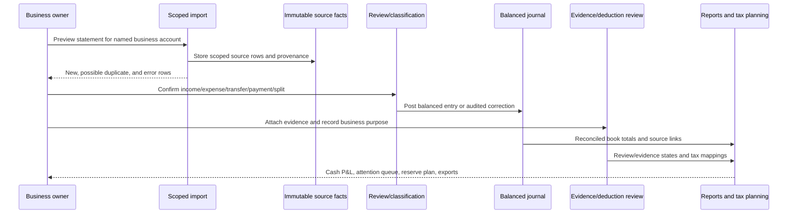
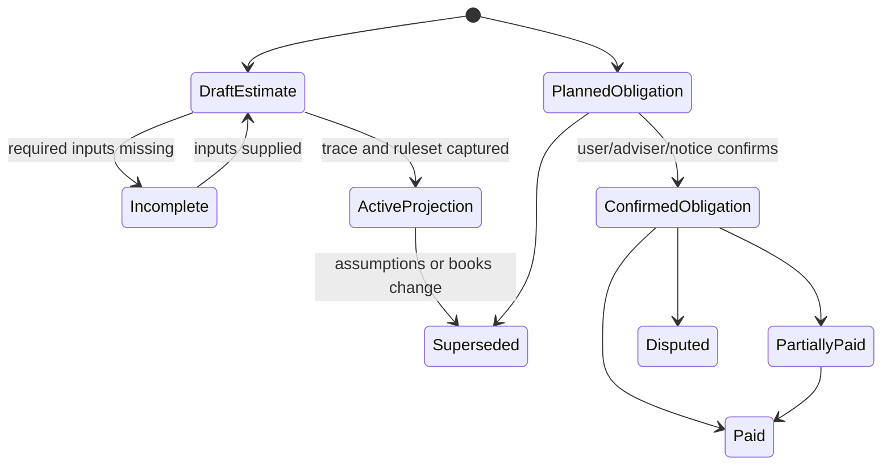
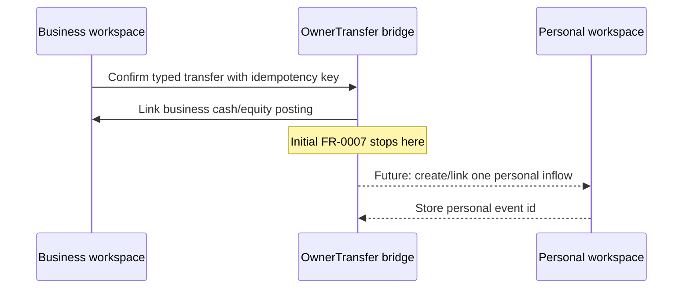

# FR-0007 — Ledger and tax model (levels 1–4)

## Main bookkeeping flow

### Error paths

- Cross-workspace account or record ids fail closed as not found/forbidden without leaking another workspace's existence.
- Duplicate similarity creates a review candidate; only a stable scoped source id/fingerprint suppresses a replay.
- Unbalanced postings cannot reach `posted` state.
- A reconciled/posted fact cannot be silently edited or deleted; correction uses reopen, reversal, and replacement with reason.
- Missing tax inputs create `incomplete` projection state, never a zero result.
- Unsafe evidence content is rejected before storage/rendering, while the financial record remains reviewable.

## Persistent state and invariants

### Workspace and identity

- Every finance root record carries non-null `workspace_id` after migration.
- A workspace is `personal` or `business`; business tax/legal configuration lives in `BusinessProfile`, not in generic workspace identity.
- Legal form and federal tax classification are separate. `unknown` is valid but disables entity-specific conclusions.

### Accounts and source facts

- An external source account maps to exactly one active ledger balance-sheet account for an effective interval.
- Account names are unique only inside one workspace; masked institution identifiers are display fields, not secrets or durable source ids.
- `SourceTransaction` is immutable after capture. It retains raw amount/sign, dates, description, source id, source file/import, fingerprint, and account.
- Business imports preserve card payments, reserve transfers, refunds, fees, and owner activity instead of filtering by description.

### Journal

- Money uses exact decimal/minor-unit storage; floats are excluded from persistence and core calculations.
- Every posted entry balances per currency: total debit equals total credit.
- Posting values are non-negative; debit/credit direction is explicit.
- A source fact links to one controlled posting chain. Corrections reverse/supersede; history remains queryable.
- Card payments, internal/reserve transfers, loan principal, owner contributions/draws, and matched transfers are profit-neutral.
- Refunds link to and reverse the original treatment where possible.

### Allocations, deductions, and evidence

- Allocation lines sum exactly to the classifiable source amount; business plus personal/nonbusiness portions conserve the whole.
- Managerial category, ledger account, tax mapping, deduction assessment, and evidence completeness are separate fields/records.
- Automation may suggest `candidate`; only an identified user/adviser review can mark an assessment reviewed.
- Evidence content is private, hashed, type/size validated, safely rendered, retention-aware, and excluded from normal logs.

### Tax and reserve state

- A reserve policy version records funding basis (`gross_receipts`, `cash_profit`, or manual), rate/amount, tax components, and effective dates.
- A reserve position reports target, actual reserved cash, pending movement, paid, and gap/surplus separately with an as-of timestamp.
- Real designated accounts and virtual buckets may coexist, but bucket totals cannot exceed available reconciled cash in their backing account.
- A tax payment links one posted cash event to obligation allocations whose amounts conserve the settled payment, excluding separately represented fees.
- Calendar/rate/form/rule sources carry jurisdiction, tax year, source URL, retrieved/reviewed dates, and version.

## Representative posting examples

| Business event | Debit | Credit | P&L effect |
|---|---|---|---|
| Client payment received | Business cash | Service income | Income once |
| Card buys software | Software expense | Card liability | Expense once |
| Checking pays card | Card liability | Business cash | None |
| Cash moved to tax reserve | Reserve cash | Operating cash | None |
| Owner contributes cash | Business cash | Owner contribution/equity | None |
| Owner draw | Owner draw/equity | Business cash | None |
| Tax payment | Configured tax/control/equity account | Business cash | Depends on declared entity/tax type; never inferred from payee |

## Income and reconciliation rules

- A deposit can be classified directly as received income or matched to a manual income record; it cannot count through both paths.
- Netted processor deposits split into gross income and fee expense while reconciling to the net cash deposit.
- Income can carry payer/client and project/contract tags. Invoicing and receivable aging are deferred.
- Statement reconciliation is per balance-sheet account/currency and stores opening/closing balances, included/outstanding items, difference, reviewer, and close/reopen history.
- A period reaches `closed` only at zero unexplained difference; reports disclose uncategorized, unreconciled, and incomplete amounts.

## Tax-planning modes

1. **Reserve rule (first slice):** applies a configured percentage/amount to gross receipts or cash profit and labels the result `reserve target`.
2. **Manual/adviser schedule (first slice):** stores confirmed or planned obligations/due dates with provenance/evidence.
3. **Planning worksheet (deferred):** may calculate selected U.S. estimated-tax components only when required whole-taxpayer inputs exist; it must expose included/excluded components, ruleset/tax year, and trace.

The engine never equates a business-only estimate with the owner's entire tax liability. Outside-business income, withholding, credits, filing status, prior-year tax, timing, entity treatment, and jurisdiction may matter.

## Future owner-transfer flow

- Transfer kinds are explicit: `draw`, `payroll`, `distribution`, `reimbursement`, and future supported types.
- Initial sole-owner draw reduces cash/equity, not business profit.
- Payroll and distributions require entity-specific modules and cannot alias a draw.
- The future personal adapter consumes one transfer id exactly once and reverses both sides atomically through audited compensating events.

## Migration and rollback

1. Establish executable migrations and a verified backup/export path for local SQLite.
2. Create seeded Personal workspace.
3. Add nullable workspace keys to existing scope roots and backfill Personal; derive transaction workspace from account and audit null-account rows.
4. Replace global uniqueness/dedupe and add scope-consistency constraints/indexes.
5. Add business ledger/evidence/tax tables.
6. Make scope keys non-null only after orphan/cross-scope audit queries pass.
7. Enable Business writes and keep legacy endpoints bound to Personal during documented deprecation.
8. Validate migration against representative existing SQLite data and PostgreSQL-compatible SQLAlchemy behavior; rollback restores the pre-migration backup rather than attempting lossy column removal.

Legacy `is_flagged_business` rows enter a reviewed migration queue. The flag alone never moves an account/transaction or establishes tax evidence.

## Security and privacy

- Workspace scope is enforced server-side in every repository/service operation; visible route state is not authorization.
- Account credentials, taxpayer ids, raw statements, receipt content, payment confirmations, signed URLs, and local filesystem paths are excluded from browser URLs, normal logs, analytics, and generic errors.
- Sensitive values are masked by default; reveal/export is explicit and auditable.
- Evidence upload allowlists verified content types/sizes, uses safe names, rejects active content, and avoids inline execution.
- Archive/correction replaces hard delete for financial history; retention/legal-hold policy governs evidence destruction.

## Validation fixtures

- Card purchase plus checking payment produces one expense and balanced account histories.
- Client deposit net of processor fee reports gross income plus fee expense and reconciles to net cash.
- Mixed-use expense conserves business and personal portions.
- Refund reduces the original category rather than becoming new income.
- Reserve transfer changes cash location but not profit or tax paid.
- Confirmed obligation, partial payment, matched settlement, and reserve roll-forward conserve amounts.
- Owner contribution/draw has no profit effect and one future bridge id.
- Import replay is idempotent while two legitimate same-day/same-amount rows survive.
- Closed-period correction uses reopen/reversal rather than mutation.
- Incomplete tax projection cannot display as confirmed or `$0 due`.
- Cross-workspace API/query attempts return no data and no existence leak.

## Current official federal reference points

Checked 2026-08-14; implementation/release must re-check the active tax year.

- [IRS: What kind of records should I keep](https://www.irs.gov/businesses/small-businesses-self-employed/what-kind-of-records-should-i-keep)
- [IRS: Estimated taxes](https://www.irs.gov/businesses/small-businesses-self-employed/estimated-taxes)
- [IRS: Self-employment tax](https://www.irs.gov/businesses/small-businesses-self-employed/self-employment-tax-social-security-and-medicare-taxes)
- [IRS: About Schedule C](https://www.irs.gov/forms-pubs/about-schedule-c-form-1040)
- [IRS: Publication 583, Starting a Business and Keeping Records](https://www.irs.gov/publications/p583)
- [IRS: Publication 505, Tax Withholding and Estimated Tax](https://www.irs.gov/publications/p505)

These sources shape recordkeeping and uncertainty contracts; they are not embedded as a permanent ruleset or individualized advice.
