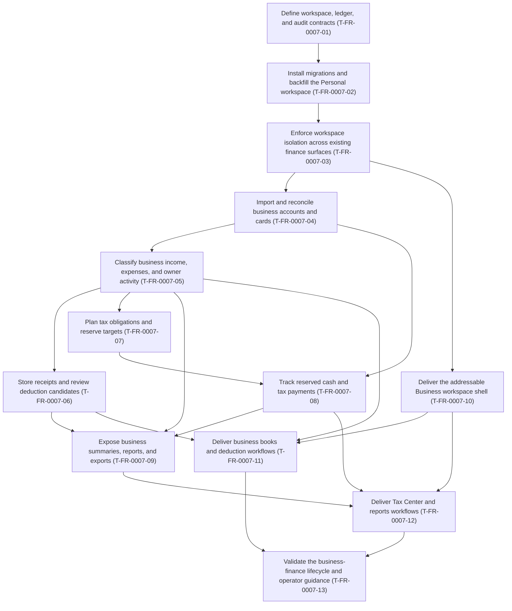

# FR-0007 — Work breakdown and DAG

## Ticket table

| ID | Title (required — human-facing name) | Type | Deps (ticket IDs) | Summary of change | Order group | Link |
|---|---|---|---|---|---|---|
| T-FR-0007-01 | Define workspace, ledger, and audit contracts | Story | none | Shared scope, exact-money, posting, correction, reconciliation, and owner-transfer contracts | P0 | [ticket](tickets.md#t-fr-0007-01--define-workspace-ledger-and-audit-contracts) |
| T-FR-0007-02 | Install migrations and backfill the Personal workspace | Story | `T-FR-0007-01` | Executable migrations, workspace/ledger tables, legacy Personal backfill, audit/recovery | P1 | [ticket](tickets.md#t-fr-0007-02--install-migrations-and-backfill-the-personal-workspace) |
| T-FR-0007-03 | Enforce workspace isolation across existing finance surfaces | Story | `T-FR-0007-02` | Scope repositories, APIs, caches, totals, rules, and legacy Personal adapters | P2 | [ticket](tickets.md#t-fr-0007-03--enforce-workspace-isolation-across-existing-finance-surfaces) |
| T-FR-0007-04 | Import and reconcile business accounts and cards | Story | `T-FR-0007-03` | Scoped accounts/imports/dedupe and statement reconciliation; preserve payments/transfers | P3 | [ticket](tickets.md#t-fr-0007-04--import-and-reconcile-business-accounts-and-cards) |
| T-FR-0007-05 | Classify business income, expenses, and owner activity | Story | `T-FR-0007-04` | Balanced guided review, splits, matching, owner activity, and corrections | P4 | [ticket](tickets.md#t-fr-0007-05--classify-business-income-expenses-and-owner-activity) |
| T-FR-0007-06 | Store receipts and review deduction candidates | Story | `T-FR-0007-05` | Private evidence plus separate versioned deduction-review context | P5 | [ticket](tickets.md#t-fr-0007-06--store-receipts-and-review-deduction-candidates) |
| T-FR-0007-07 | Plan tax obligations and reserve targets | Story | `T-FR-0007-05` | Reserve policies, incomplete/versioned projections, and sourced obligations | P5 | [ticket](tickets.md#t-fr-0007-07--plan-tax-obligations-and-reserve-targets) |
| T-FR-0007-08 | Track reserved cash and tax payments | Story | `T-FR-0007-04`, `T-FR-0007-07` | Reconciled reserve positions and matched obligation payment lifecycle | P6 | [ticket](tickets.md#t-fr-0007-08--track-reserved-cash-and-tax-payments) |
| T-FR-0007-09 | Expose business summaries, reports, and exports | Story | `T-FR-0007-05`, `T-FR-0007-06`, `T-FR-0007-08` | Traceable cash books, tax roll-forward, audit read models, and safe exports | P7 | [ticket](tickets.md#t-fr-0007-09--expose-business-summaries-reports-and-exports) |
| T-FR-0007-10 | Deliver the addressable Business workspace shell | Story | `T-FR-0007-03` | Personal/Business switcher, addressable routes, nav, cache boundary, base states | P3 | [ticket](tickets.md#t-fr-0007-10--deliver-the-addressable-business-workspace-shell) |
| T-FR-0007-11 | Deliver business books and deduction workflows | Story | `T-FR-0007-05`, `T-FR-0007-06`, `T-FR-0007-10` | Accounts/activity/income/expense/deduction user workflows | P7 | [ticket](tickets.md#t-fr-0007-11--deliver-business-books-and-deduction-workflows) |
| T-FR-0007-12 | Deliver Tax Center and reports workflows | Story | `T-FR-0007-08`, `T-FR-0007-09`, `T-FR-0007-10` | Tax Center states, history, reports, and downloads | P8 | [ticket](tickets.md#t-fr-0007-12--deliver-tax-center-and-reports-workflows) |
| T-FR-0007-13 | Validate the business-finance lifecycle and operator guidance | Task | `T-FR-0007-11`, `T-FR-0007-12` | Cross-layer acceptance/security/migration/browser validation and operator docs | P9 | [ticket](tickets.md#t-fr-0007-13--validate-the-business-finance-lifecycle-and-operator-guidance) |

## DAG (Mermaid)

## Parallel delivery notes

- After [**Enforce workspace isolation across existing finance surfaces** (`T-FR-0007-03`)](tickets.md#t-fr-0007-03--enforce-workspace-isolation-across-existing-finance-surfaces), [**Import and reconcile business accounts and cards** (`T-FR-0007-04`)](tickets.md#t-fr-0007-04--import-and-reconcile-business-accounts-and-cards) and [**Deliver the addressable Business workspace shell** (`T-FR-0007-10`)](tickets.md#t-fr-0007-10--deliver-the-addressable-business-workspace-shell) may run in parallel if file ownership is separated.
- After [**Classify business income, expenses, and owner activity** (`T-FR-0007-05`)](tickets.md#t-fr-0007-05--classify-business-income-expenses-and-owner-activity), the evidence stream (`T-FR-0007-06`) and tax-planning stream (`T-FR-0007-07`) may run in parallel.
- The active FR-0006 branch overlaps core models, API registration, frontend shell, dependencies, and validation infrastructure. Before the first implementation wave, record whether FR-0006 has landed, will be rebased first, or is intentionally excluded from the chosen integration base.
- `CashFlowNode`/allocation-plan entities from FR-0006 may link to canonical `LedgerAccount` ids only after `T-FR-0007-01`; they are not an alternate business account system.

## First eligible implementation set

Only [**Define workspace, ledger, and audit contracts** (`T-FR-0007-01`)](tickets.md#t-fr-0007-01--define-workspace-ledger-and-audit-contracts) is dependency-eligible initially. The first implementation handoff must also record the FR-0006 integration state before changing overlapping files.

## Map to trackers

- Canonical sections: [`tickets.md`](tickets.md)
- Global index and TEST→DEV→VAL DAG: [`docs/design/tickets-initial.md`](../../../docs/design/tickets-initial.md)
- Progress: [`tasks/ticket-progress.md`](../../ticket-progress.md)
