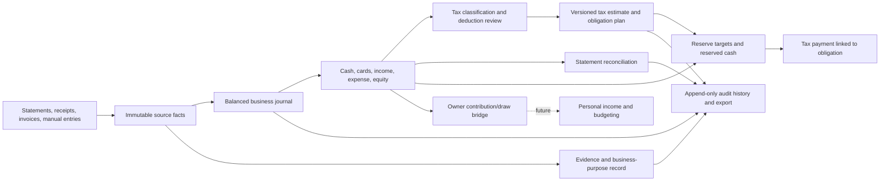

# FR-0007 — Accounting and tax domain design

| Field | Value |
|---|---|
| **Date** | 2026-08-14 |
| **Stage** | Parallel design stream — accounting/tax domain, before canonical ticketing |
| **Feature** | `FR-0007-business-finance-management` |
| **Scope** | U.S.-first contract-work business finance workspace; model must remain jurisdiction-, entity-, form-, rate-, and effective-date configurable |
| **Implementation** | None; recommendations and ticket implications only |

## Executive summary

Build the business workspace on a small, balanced business subledger rather than extending the current personal transaction row with more booleans. A bank or card import is a source fact; its accounting classification, tax treatment, evidence, reconciliation state, and audit history are separate, versioned facts. This prevents credit-card payments, reserve transfers, refunds, owner draws, and tax payments from being counted as new income or expense.

The first useful release should manage one contract-work business with cash accounts, tax-reserve accounts or buckets, business credit cards, imported and manual income/expenses, split classification, deduction-review evidence, cash-basis reports, statement reconciliation, estimated-tax planning, tax obligations/payments, and owner contributions/draws. It should not claim to prepare or file a tax return. Payroll, invoicing/receivables, sales tax, depreciation, inventory, multi-owner accounting, and entity-specific tax engines should remain explicit later modules.

The tax experience must keep three amounts visibly distinct:

1. **Estimated obligation** — a versioned planning or tax-professional-provided amount for a jurisdiction and tax period.
2. **Reserve target and reserved cash** — a planning target and the actual cash or virtual allocation set aside; neither is a tax payment.
3. **Payment** — a real cash movement to a tax authority, linked to an obligation and supported by confirmation evidence.

This is product and data-model guidance, not tax, legal, or accounting advice. Entity classification, accounting method, deductible treatment, deadlines, rates, forms, and filed amounts must be user- or adviser-confirmed and effective-dated.

## Assumptions and boundaries

- The initial user is a single owner starting contract work in the United States, but the application must not silently assume that the business is a sole proprietorship or that an LLC has a particular federal tax classification.
- MVP reporting is cash-oriented because source data is bank/card activity. The selected accounting and tax methods are stored explicitly; accrual workflows are deferred rather than simulated incompletely.
- USD is the MVP presentation currency. Every monetary row still stores a currency and uses exact decimal/minor-unit arithmetic; cross-currency realization is deferred.
- A single deployment may later contain multiple businesses. Every business-owned record therefore carries an immutable `business_id` boundary from day one.
- Existing `Account` and `Transaction` records are personal-finance oriented. In particular, the current ingest path filters card payments and uses one sign convention for all account types. The business design cannot rely on that behavior for reconciliation or transfer accounting.
- The workspace helps assemble books, evidence, planning estimates, and exports. It does not determine eligibility, certify deductions, submit returns, initiate tax payments, or replace a tax professional.
- State and local income/franchise taxes, registration fees, and deadlines vary. Sales tax is a separate deferred subsystem, not another deduction category.

## Source-grounded product constraints

These are federal concepts used to shape the recordkeeping product. They are not a complete tax ruleset.

| Constraint | Product consequence |
|---|---|
| The IRS allows a suitable recordkeeping system but expects books that show gross income, deductions, and credits, with supporting documents for business activity. | Preserve source transactions, business classifications, tax mappings, and evidence as linked records; provide period exports rather than only dashboard totals. |
| Electronic records must be complete, accurate, retrievable, and protected by controls against unauthorized addition, alteration, or deletion. | Posted/reconciled facts need append-only audit events, revisions or reversals, content hashes for evidence, and reproducible exports. |
| Business and personal uses of a mixed expense must be separated; the personal portion is generally not deductible. | Support allocation splits and an explicit business-use percentage/amount; never infer 100% deductibility from a business card or category. |
| A deductible business expense generally must be ordinary and necessary, but category alone cannot establish that factual determination. | A tax category is a reporting aid. Store deduction status, rationale, evidence state, reviewer, and ruleset version separately. |
| Supporting expense records can require payee, amount, payment proof, date, and a description showing business purpose; some categories require additional substantiation. | Evidence readiness must be field-level and category-aware, with `needs_review` rather than a false eligible/ineligible binary. |
| A business structure affects federal filing forms; a sole proprietor generally reports business profit/loss on Schedule C and may also have self-employment and estimated-tax obligations. | Store legal form and federal tax classification separately, and select tax packs by entity/jurisdiction/effective date. Do not hard-code Schedule C into the core ledger. |
| Estimated tax can include income tax, self-employment tax, and other taxes; its computation uses more than business profit and can be revised during the year. Uneven income can also change installment calculations. | Version estimate snapshots, identify included tax components and outside-business inputs, and label confidence/source. A flat reserve percentage is a cash-planning rule, not an amount “due.” |
| Tax records are retained according to the applicable limitation period and some records, such as asset or employment records, can require different handling. | Retention must be policy-driven and allow legal holds; MVP must not offer irreversible “delete tax year” behavior. |

## Recommended domain boundaries

### 1. Business identity and configuration

`BusinessProfile`

- `id`, display/legal names, active dates, base currency, timezone.
- `legal_form`: user-declared state-law form, including `unknown`.
- `federal_tax_classification`: independently declared value such as `unknown`, `sole_proprietor_or_disregarded`, `partnership`, `s_corporation`, or `c_corporation`.
- `jurisdictions`: country, federal, state, and local registrations relevant to tax plans.
- `book_accounting_method` and `tax_accounting_method`: explicit `cash`, `accrual`, or `unknown`, each with effective dates and provenance.
- Tax year/fiscal year configuration and tax-professional contact metadata, without placing full taxpayer identifiers in ordinary logs.

Do not infer tax classification from “LLC.” Do not allow a tax ruleset to become active while required classification inputs are `unknown`; the workspace can still keep operational books.

### 2. Accounts, cards, and chart of accounts

`LedgerAccount`

- Scoped to one business and one currency.
- Account class: `asset`, `liability`, `equity`, `income`, or `expense`.
- Operational subtype: checking, savings, tax-reserve cash, petty cash, credit card, loan, payment processor clearing, accounts receivable/payable, owner contribution, owner draw, income, expense, or tax-control account.
- Connection metadata belongs in a separate source/connector record; credentials never belong in the ledger row.
- Lifecycle: `draft` → `active` → `closed`. Closing prevents new postings but preserves history.

`ExternalAccountSource`

- Institution/source identifiers, masked display data, import method, last successful import, and source-account currency.
- Exactly one active mapping to a business balance-sheet account for a given effective interval.

MVP should ship a small preset chart while allowing labels and managerial categories to change. Core account class and system roles must remain controlled so a user cannot accidentally turn a transfer account into revenue.

### 3. Source transactions and balanced journal

`SourceTransaction` is the immutable imported/manual fact: raw date, posted date, raw amount/sign, description, source account, source file/import run, external id when supplied, and a content fingerprint. It is not itself the final accounting treatment.

`JournalEntry` is the business event, with one or more `Posting` rows:

- Every posted entry balances exactly by currency: total debits equal total credits.
- Posting amounts are non-negative exact decimals/minor units; debit/credit direction is explicit rather than inferred from a universal sign convention.
- A source transaction may link to one journal entry, or to a controlled group when a correction/split demands it; the relationship is unique and audited.
- Posted entries are not hard-deleted. Corrections use a reversing entry plus a replacement, linked to the prior entry and reason.
- Draft classification may be edited; posting/reconciliation locks enforce the reversal path.

Examples:

| Event | Posting result | Profit/loss effect |
|---|---|---|
| Client pays an invoice or cash-basis receipt | Debit business cash; credit service income | Income increases once |
| Business card buys software | Debit software expense; credit card liability | Expense increases once |
| Checking pays the business card | Debit card liability; credit checking | None; transfer only |
| Checking moves cash to tax-reserve savings | Debit reserve cash; credit operating cash | None; transfer only |
| Owner contributes personal cash | Debit business cash; credit owner contribution/equity | None |
| Sole-proprietor owner withdrawal | Debit owner draw/equity; credit business cash | None; not a business expense |
| Tax payment | Debit configured tax/control/equity account; credit cash | Treatment depends on entity/tax type; never infer deductibility from the payee |

The journal can remain invisible to most MVP users: the classification UI presents “income,” “expense,” “transfer,” “card payment,” “owner contribution,” “owner draw,” “refund,” and “tax payment,” then creates controlled postings.

### 4. Income lifecycle

`IncomeDetail` links a revenue-side journal entry to:

- client/source name and optional project/contract;
- gross amount, fees withheld, refunds/chargebacks, and net deposited amount;
- service/performance date and cash-received date;
- evidence such as invoice, remittance, payment-processor statement, or information-return document;
- tax reporting tags and review state, not a promise that an information return matches taxable income.

Lifecycle:

1. Import a deposit or create a manual receipt.
2. Classify as business income, transfer, contribution, loan proceeds, refund, or `needs_review`.
3. If processor fees are netted, split gross revenue and fee expense so gross receipts are not understated.
4. Match supporting evidence and optionally a client/project.
5. Post, reconcile, and include in cash-basis reporting.
6. Reclassify by audited reversal/replacement when later evidence changes the treatment.

Invoicing and accounts receivable are deferred. MVP may attach an invoice to received income but must not claim to manage outstanding receivables.

### 5. Expense, category, and deduction lifecycle

Keep these concepts separate:

- **Book/managerial category**: how the owner understands operations, such as software or subcontractors.
- **Ledger account**: where the balanced posting is recorded.
- **Tax category mapping**: a configurable tax-pack mapping for a jurisdiction, entity classification, form/revision, and effective tax year.
- **Deduction review**: the asserted tax treatment for this transaction/allocation, including evidence and provenance.

`TransactionAllocation`

- Supports multiple lines whose monetary amounts sum exactly to the source transaction’s classifiable amount.
- Each line includes business amount/percentage and personal or nonbusiness remainder.
- Includes `expense`, `asset_candidate`, `owner_personal`, `transfer`, `loan`, `tax`, or `needs_review` treatment.
- Refunds link to the original allocation when possible and reduce the same category rather than becoming income.

`DeductionAssessment`

- Status: `unreviewed`, `candidate`, `needs_evidence`, `reviewed_eligible`, `reviewed_limited`, `reviewed_ineligible`, `not_applicable`, or `superseded`.
- Claimed/candidate amount, business-use percentage, limitation percentage, reason, notes, and source (`user`, `rule_suggestion`, `tax_professional`, `import`).
- Jurisdiction, tax year, entity classification, rule-pack/version, relevant form/category mapping, reviewer, and review timestamp.
- A suggested category may prefill `candidate`; automation alone must not set `reviewed_eligible`.

`EvidenceItem` and `EvidenceLink`

- Original filename/type, capture date, document date, immutable content hash, encrypted/private storage reference, and retention policy.
- Links to transactions, allocations, income, obligations, or payments; one document may support multiple records without duplication.
- Completeness fields: payee/source, amount, payment proof, date, business-purpose description, participants/destination where category-specific, and freeform notes.
- Virus/type/size validation and safe rendering are implementation requirements; do not serve uploaded active content directly.

MVP may flag mileage, travel, meals, home-office, startup costs, inventory, and durable equipment for specialized review. It should not implement the detailed calculators for those categories in the first slice.

### 6. Estimated tax and obligation model

Use `TaxPlan` as a container for one business/taxpayer planning context and `TaxEstimateVersion` as an immutable snapshot.

`TaxEstimateVersion`

- Jurisdiction, tax type/component, tax year, calculation period, effective ruleset, and entity/taxpayer context reference.
- Inputs from the books: recognized gross income, reviewed/candidate deductions, net business profit, and payments to date.
- Outside-business inputs: filing status, other income, withholding, credits, prior-year tax, and adjustments—stored as user/professional inputs with provenance, or explicitly marked missing.
- Method: `manual`, `tax_professional_schedule`, `flat_reserve_rate`, `regular_installment_projection`, or later `annualized_income_projection`.
- Results: projected annual tax, projected required payment, confidence/completeness, warnings, and calculation trace.
- Status: `draft` → `active_projection` → `superseded`; a projection is never called filed or confirmed.

`TaxObligation`

- The actionable schedule for a jurisdiction, tax type, tax period, due date, amount, and source.
- Source/confidence: `user_confirmed`, `tax_professional_confirmed`, `authority_notice`, or `projection`.
- Status: `planned`, `confirmed`, `partially_paid`, `paid`, `overdue`, `waived`, `superseded`, or `disputed`.
- Links to estimate version, notices/evidence, payments, and any filing record.
- A due date is loaded from an effective-dated tax calendar or entered/confirmed by the user. The system must not permanently hard-code calendar dates because weekends, holidays, disaster relief, fiscal years, entity types, and law changes can alter them.

MVP calculation modes:

1. **Reserve rule**: user-selected percentage of eligible cash inflows or profit. Output says “reserve target,” never “tax due.”
2. **Manual/professional schedule**: authoritative-for-the-app installment amounts and due dates supplied by the owner or adviser, with evidence/provenance.
3. **Planning projection**: optional U.S. individual estimated-tax worksheet model only when required personal inputs are present; show included/excluded components, tax-year/ruleset version, and a printable calculation trace. Missing personal inputs make the result incomplete, not zero.

### 7. Tax reserve model

`ReservePolicy`

- Applies to a business, jurisdiction/tax component, effective dates, and funding basis (`gross_receipts`, `cash_profit`, or `manual`).
- Target rate/amount and optional minimum buffer.
- Versioned so historical reserve recommendations reproduce exactly.

`ReservePosition`

- Target amount from the active policy or confirmed obligations.
- Actual reserved cash from one or more designated bank accounts **or** a virtual bucket over a real cash account.
- Pending transfers, paid-to-date, shortfall/surplus, and as-of timestamp.

Critical distinctions:

- A virtual bucket cannot make more cash exist; bucket allocations across an account cannot exceed the account’s available reconciled cash.
- Designating an account as a tax reserve does not make its balance deductible, paid, or legally restricted.
- Moving cash into a reserve is a balance-sheet transfer, not a tax expense or payment.
- A tax payment reduces cash and the linked obligation. It should not reduce reserved cash a second time through an independent adjustment.
- The UI should show `target`, `reserved`, `due`, and `paid` as four labeled values, with a visible “as of” date.

### 8. Tax payment lifecycle

`TaxPayment`

- Links a posted cash transaction to one or more tax obligations.
- Jurisdiction/authority, tax type, tax period, initiated/settled dates, payment method, confirmation number (encrypted or masked where appropriate), amount, and evidence.
- Status: `scheduled` → `pending` → `settled`, with `failed`, `canceled`, `reversed`, or `refunded` branches.
- Allocation across obligations sums exactly to the settled cash amount, except a separately represented fee.

Lifecycle:

1. Obligation exists as projected or confirmed.
2. User records a scheduled payment; MVP does not transmit it.
3. Bank transaction arrives and is matched without creating a duplicate payment.
4. Settlement links cash, obligation allocation, and confirmation evidence.
5. Obligation balance and reserve position recompute from ledger/payment facts.
6. Refund/reversal is a new linked event; history remains intact.

### 9. Reconciliation

`StatementPeriod` stores account, opening/closing dates and balances, source document/hash, import run, and state.

`ReconciliationSession`

- Tracks included cleared items, outstanding items, adjustments, computed ending balance, statement ending balance, difference, reviewer, and timestamps.
- States: `draft` → `balanced` → `closed`; a closed reconciliation can be reopened only with a reason and audit event.
- Reconciliation is per balance-sheet account and currency. Profit/loss totals are never the reconciliation target.

Rules:

- Card charges, credits, interest/fees, and payments remain present. The payment is matched to checking and the card liability rather than filtered out.
- Imported source uniqueness is scoped by source account and external id; a fallback fingerprint includes date, amount, normalized description, and source file/import identity. Similar real transactions must not be silently discarded.
- A transfer matcher proposes links but cannot merge or delete source facts automatically.
- Closed-period edits require reversal/replacement or an explicit reopen workflow.
- Reports expose unreconciled and uncategorized totals so completeness is visible.

### 10. Audit history and exports

`AuditEvent`

- Append-only actor, timestamp, action, entity type/id, before/after digest or patch, reason, source/import id, request/correlation id, and ruleset/calculation version where relevant.
- Events cover imports, classifications, deduction reviews, evidence changes, posting/reversal, reconciliation close/reopen, estimate activation, obligation changes, reserve policies, and payment matching.
- Sensitive evidence and taxpayer/payment identifiers do not appear in ordinary event payloads; audit events reference access-controlled objects.

Required exports:

- Journal/posting detail and chart of accounts.
- Cash-basis profit and loss with drill-through to source and evidence.
- Income-source and 1099 reconciliation worksheet (information-return amounts are evidence, not the income ledger itself).
- Expense/deduction review register with candidate/reviewed amounts and missing-evidence flags.
- Tax estimate versions, obligation schedule, reserve roll-forward, and payment confirmations.
- Account reconciliation reports and unresolved-item list.
- An audit/change report sufficient to explain classification revisions and reversals.

Exports must identify business, period, accounting method, currency, as-of time, active tax-pack versions, included statuses, and any incomplete/unreconciled records.

## Future business-to-personal bridge

Owner funding and owner pay must use explicit paired events, never category reuse.

`OwnerTransfer`

- Business-side event type (`owner_draw`, `owner_contribution`, or later `payroll_payment`/`distribution`).
- Business posting id, amount/currency/date, owner identity, and status.
- Optional future personal-side linked event id and an idempotency key shared across the boundary.
- Business and personal records retain separate workspace ownership while a bridge record proves they represent one economic movement.

For the initial sole-owner/cash-books mode, an owner draw reduces business cash/equity and does not reduce business profit. When personal integration arrives, the matched personal event becomes an inflow source for budgeting without creating a second business expense. Payroll and entity distributions cannot be aliases for an owner draw: they require entity-specific payroll/equity models and are deferred.

## Critical invariants

1. **Tenant boundary:** every business record is scoped by `business_id`; cross-business joins require an explicit bridge/export contract.
2. **Balanced books:** every posted journal entry balances exactly per currency; reports derive from postings, never cached editable totals.
3. **Exact money:** no binary floating-point persistence or arithmetic for money, rates, allocations, or reconciliation.
4. **Source preservation:** raw imports and evidence are immutable; corrections append classifications, reversals, or replacements.
5. **Idempotent ingest:** reimporting the same source event cannot duplicate it, but similarity alone cannot erase two legitimate transactions.
6. **Split conservation:** allocation amounts equal the source amount; business plus personal/nonbusiness portions equal the whole.
7. **Transfer neutrality:** card payments, reserve movements, internal transfers, loan principal, owner contributions, and owner draws do not create income or expense.
8. **Refund continuity:** refunds/reimbursements link back and reverse the appropriate classification rather than defaulting to new income.
9. **Category is not deductibility:** account/category suggestions cannot mark an item reviewed eligible.
10. **Evidence is not a verdict:** attaching a receipt improves substantiation state but does not establish eligibility by itself.
11. **Tax-state separation:** estimate, obligation, reserve target, reserved cash, filing, and payment are distinct entities and amounts.
12. **No false certainty:** incomplete calculation inputs produce an incomplete projection and warning, not `$0 due` or “safe.”
13. **Effective dating:** jurisdiction rules, forms, rates, calendars, tax classifications, accounting methods, and reserve policies are versioned by effective interval/tax year.
14. **Reproducibility:** every tax or report output records inputs, status filters, book cutoff, ruleset/version, and calculation hash.
15. **Reconciliation integrity:** a closed statement period has zero unexplained difference; reopening records actor and reason.
16. **Correction trail:** posted/reconciled/tax-reviewed facts cannot be hard-edited or deleted; reversal and supersession preserve the chain.
17. **Owner-transfer uniqueness:** a personal bridge consumes one business owner-transfer id exactly once.
18. **Privacy:** evidence, taxpayer identifiers, bank credentials, and payment confirmations are access-controlled and excluded from general logs/exports by default.

## MVP recommendation

The MVP is operational bookkeeping and tax readiness for one owner and one business—not a complete accounting suite or tax-preparation product.

### Essential MVP

- One business profile with explicit legal form, tax classification, accounting method, jurisdictions, tax year, and base currency; unknowns are allowed but visible.
- Preset balanced chart of accounts plus business checking/savings/tax-reserve cash and business credit-card accounts.
- Statement CSV/manual import that preserves charges, deposits, fees, refunds, and card payments, with reviewable idempotency and source provenance.
- Guided classification into income, expense, split business/personal, transfer, card payment, loan, owner contribution/draw, tax payment, refund, or needs review.
- Client/source tagging for received income and net-deposit fee splitting.
- Managerial category, tax-category suggestion, deduction-review status, business purpose, and receipt/evidence attachment.
- Uncategorized, unreconciled, mixed-use, asset-candidate, and missing-evidence queues.
- Cash-basis P&L, cash movement, account balances, income-source summary, expense/deduction review register, and export.
- Monthly checking and card reconciliation with close/reopen audit history.
- Manual/flat-rate reserve policies, actual reserve accounts or bounded virtual buckets, and reserve shortfall view.
- Versioned projected or externally confirmed tax obligations and recorded/matched payments; reminders use configurable due dates.
- Owner contribution/draw posting and an unimplemented but stable bridge identifier for later personal integration.
- Append-only audit events, reversal/supersession behavior, retention-aware evidence, and reproducible exports.

### Explicitly deferred

- Tax-return preparation/e-filing, automatic deduction eligibility decisions, penalty calculation, tax-payment initiation, or guarantees of tax accuracy.
- Full U.S. federal/state/local tax engines, scenario-complete Form 1040/1040-ES computation, or hard-coded tax rates/deadlines/forms.
- Payroll, employer tax deposits/returns, employee records, benefits, S-corporation officer compensation, W-2 production, or contractor information-return filing.
- Sales-tax nexus determination, registration, rate lookup, collection, marketplace-facilitator logic, filings, and remittance.
- Invoicing, accounts receivable/payable, bill pay, purchase orders, time tracking, and project profitability beyond simple tags.
- Inventory/COGS, fixed-asset register, depreciation/amortization/Section 179 calculators, startup-cost amortization, mileage logs, home-office calculation, per diem, and specialized travel/meal substantiation.
- Accrual books, adjusting/closing journal UI, trial balance close management, retained earnings close, multi-period lock approvals, and CPA write-up workflows.
- Multi-entity consolidation, partnership/multi-owner capital accounts, corporate distributions, intercompany transactions, and multi-currency realized gains/losses.
- Live bank feeds, payment initiation, OCR-based eligibility claims, and automatic matching without review.

## Risks and mitigations

| Risk | Why it matters | Recommended mitigation |
|---|---|---|
| Business-only tax estimate is presented as total tax due | Individual estimated tax can depend on nonbusiness income, withholding, credits, filing status, prior-year tax, and timing. | Use reserve-only and incomplete-projection labels; permit adviser-provided obligations; require completeness checks and calculation trace. |
| Current ingest filters card payments | Business cards cannot reconcile, and transfers could be double-counted or disappear. | Preserve all business account activity; classify and match transfers instead of filtering. |
| Current universal amount sign leaks into account logic | The same sign can have different economic meaning for asset and liability accounts. | Use explicit debit/credit postings and source-specific normalization. |
| `is_flagged_business` becomes the business boundary | A mutable flag cannot isolate books, evidence, tax settings, or reports. | Introduce immutable business ownership and a bridge/migration path for flagged legacy transactions. |
| Categories become tax conclusions | Users may rely on suggestions and overstate deductions. | Separate managerial, ledger, tax mapping, and reviewed deduction status; show provenance and warnings. |
| Tax reserve is confused with tax payment | The dashboard could overstate compliance or understate available cash. | Model targets, actual cash/buckets, obligations, and settled payments independently; reconcile all cash. |
| Hard-coded rules age silently | Tax law, forms, thresholds, dates, and local requirements change. | Effective-dated jurisdiction packs with source URL, retrieved date, review date, version, and manual override. |
| Mutable records destroy auditability | Reconciliation and tax exports become unreproducible. | Immutable source/evidence hashes, append-only audit events, reversal/replacement, period close/reopen reasons. |
| Evidence storage exposes sensitive data | Receipts and tax documents can contain account, address, or taxpayer data. | Private object storage, encryption, malware/type checks, redacted logs, access audit, safe download/rendering. |
| “Full accounting” expands MVP indefinitely | Payroll, tax, invoicing, sales tax, assets, and accrual accounting are separate products. | Define MVP as a balanced cash-books and tax-readiness slice; use module seams and deferred capability flags. |
| Owner draw/payroll/distribution are conflated | Profit, tax, and personal income can be materially misstated. | Keep separate event types; owner draw only in configured sole-owner mode; require a future payroll/equity module for other flows. |

## Ticket implications for the parent design

The canonical ticket plan should preserve these dependency seams; titles below are proposals, not allocated ticket IDs.

| Proposed ticket title | Purpose and primary acceptance implications | Dependency notes |
|---|---|---|
| **Define business ledger, money, and audit contracts** | Business boundary; chart/account roles; source facts; balanced journal/postings; exact money; reversal/supersession; audit-event envelope. Contract tests should prove balance and workspace isolation. | Foundation for every other business ticket; serialize schema ownership here. |
| **Migrate and preserve business account activity** | Add business accounts/cards and source mappings; import deposits, charges, refunds, fees, and payments; idempotency and legacy `is_flagged_business` migration/projection. | After contracts; must land before reconciliation and reports. |
| **Classify and split business transactions** | Guided event types, allocation conservation, transfer matching, refund links, owner contribution/draw, net-deposit fee splits, review queues. | After ledger/import foundation. |
| **Capture evidence and deduction reviews** | Private evidence storage contracts, hashes, business-purpose fields, managerial/tax mapping separation, mixed-use splits, review status/provenance, asset/special-category flags. | Can proceed alongside reconciliation after core transaction contracts. |
| **Reconcile checking and credit-card statements** | Statement periods, opening/closing balances, cleared/outstanding items, zero-difference close, card-payment pairing, reopen/reversal audit. | Depends on preserved business activity and transfer types. |
| **Report business books and tax-readiness exports** | Cash P&L, cash movement, balances, income-source and deduction registers, unreconciled/incomplete disclosures, reproducibility metadata. | Depends on classification; final VAL depends on reconciliation and evidence. |
| **Plan tax obligations and reserve cash** | Versioned reserve policies, bounded virtual/real reserve positions, projected vs confirmed obligations, configurable calendars/rulesets, incomplete-input warnings. | Depends on business reports/ledger totals; rules config can be built in parallel with evidence. |
| **Record and reconcile tax payments** | Payment lifecycle, bank match, obligation allocation, confirmation evidence, reserve roll-forward, reversal/refund. | Depends on obligations, journal, and reconciliation primitives. |
| **Expose owner-transfer bridge contract** | Owner contributions/draws, stable idempotent personal bridge id, no personal-side implementation, explicit payroll/distribution exclusions. | Depends on transaction types; can be a contract slice or part of classification ticket. |
| **Validate accounting invariants and operator workflow** | Cross-ticket fixtures for card purchase/payment, mixed expense, net client deposit, reserve transfer, tax payment, refund, owner draw, period close/reopen, exports, and audit history. | Final integration/VAL ticket; rendered UI validation belongs in UI-owning tickets. |

Test fixtures should include at least:

- a card purchase and later checking payment with one expense total and balanced account histories;
- a client payment net of processor fee that reports gross income plus fee expense;
- a mixed-use expense whose business and personal portions conserve the source amount;
- a refund tied to the original expense;
- a reserve transfer that changes cash location but not profit or tax paid;
- a confirmed obligation, partial payment, matched settlement, and reserve roll-forward;
- an owner contribution and draw with no business profit effect;
- a duplicate import replay and two legitimate same-day/same-amount transactions;
- a reconciled period correction performed through reopen or reversal, never silent mutation;
- an incomplete tax projection that cannot display as confirmed or zero due.

## Design decisions the parent should resolve before tickets are canonical

1. **MVP books:** accept the recommended balanced subledger with a guided UI, or explicitly choose a simpler single-entry ledger and record the reconciliation/transfer limitations. Balanced postings are strongly recommended.
2. **Initial tax classification:** require the owner to select it during setup, or allow `unknown` and disable entity-specific tax mappings until confirmed. Allowing `unknown` is safer.
3. **Tax calculator depth:** ship reserve percentage plus manual/professional obligations, or also implement a versioned U.S. individual planning worksheet. The former is the safer first release.
4. **Reserve representation:** require a real designated bank account, allow virtual buckets, or support both. Supporting both is useful only if the UI explains that virtual buckets do not isolate real cash.
5. **Evidence storage:** local encrypted/private blob storage vs externally referenced files. The decision must cover backups, retention, export, and safe rendering.
6. **Legacy business flags:** migrate selected flagged personal transactions into the business journal, reference them read-only, or leave historical data outside MVP. Migration requires a review screen because a flag is not sufficient accounting evidence.

## Official U.S. federal sources

Checked 2026-08-14. Product rules should store source/review dates and re-check the current tax-year material before implementation or release.

- IRS, [What kind of records should I keep](https://www.irs.gov/businesses/small-businesses-self-employed/what-kind-of-records-should-i-keep) — books, income/expense records, supporting documents, and substantiation fields.
- IRS, [How should I record my business transactions](https://www.irs.gov/businesses/small-businesses-self-employed/how-should-i-record-my-business-transactions) — journals/ledgers and complete, accurate, accessible electronic records.
- IRS, [Publication 583, Starting a Business and Keeping Records](https://www.irs.gov/publications/p583) — separate business records/accounts, accounting-method consistency, reconciliation, electronic-record controls, charts of accounts, and retention.
- IRS, [Burden of proof](https://www.irs.gov/businesses/small-businesses-self-employed/burden-of-proof) — documentary evidence and added substantiation for certain expense types.
- IRS, [Publication 334 (2025), Tax Guide for Small Business](https://www.irs.gov/publications/p334) — ordinary/necessary expense framing and separation of mixed business/personal use.
- IRS, [Instructions for Schedule C (Form 1040) (2025)](https://www.irs.gov/instructions/i1040sc) — current sole-proprietor income/expense reporting context and related forms; not a generic chart of accounts.
- IRS, [Business structures](https://www.irs.gov/businesses/small-businesses-self-employed/business-structures) and [Sole proprietorships](https://www.irs.gov/businesses/small-businesses-self-employed/sole-proprietorships) — entity form affects filing obligations; Schedule C, Schedule SE, and Form 1040-ES are distinct concepts for sole proprietors.
- IRS, [Publication 505 (2026), Tax Withholding and Estimated Tax](https://www.irs.gov/publications/p505) — estimated tax scope, whole-taxpayer inputs, installment timing, revisions, and annualized-income method.
- IRS, [About Publication 538, Accounting Periods and Methods](https://www.irs.gov/forms-pubs/about-publication-538) — accounting methods and periods are their own configured tax concepts.
- IRS, [Tax Calendar](https://www.irs.gov/businesses/small-businesses-self-employed/tax-calendar) — current deadline discovery; use as a reviewed source, not a permanently embedded calendar.

## Suggested next step

The serial design owner should merge these domain boundaries into `10-design-00-skeleton.md` and `10-design-01-ledger-and-tax-model.md`, then align the UI stream around the same separation of books, deduction review, tax obligations, reserves, and payments. Canonical tickets should begin with the business-ledger/audit contract and must preserve card-payment activity before tax or reporting work starts.

## Options

- **A. Recommended — trustworthy cash-books MVP:** balanced hidden subledger, imported/manual activity, deduction evidence, reconciliation, reserve planning, manual/professional tax obligations, and recorded payments. Add the complete tax worksheet later.
- **B. Calculator-heavy MVP:** include a versioned U.S. individual estimated-tax projection in the first release. This increases personal-data coupling, rules maintenance, and risk of false certainty.
- **C. Minimal tracker:** retain the current one-sided transaction model and add business/tax flags. This is fastest but is not recommended because card payments, reserve transfers, owner draws, and reconciliation remain structurally ambiguous.
